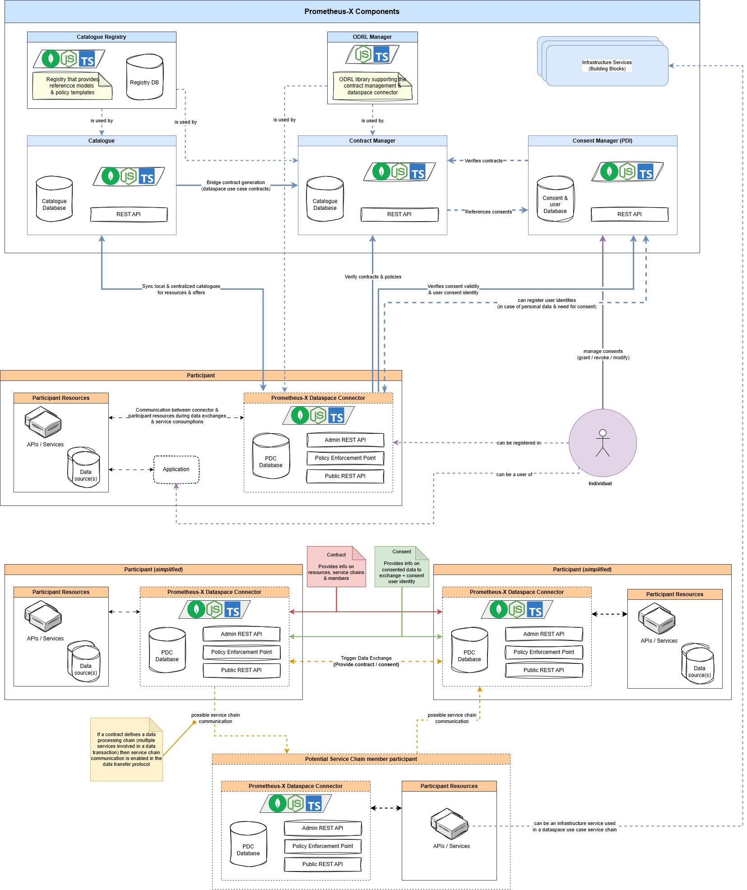

## Documentation of Prometheus-X Components & Services

You can find the comprehensive documentation for all components at [Prometheus-X Documentation](https://Prometheus-X-association.github.io/docs/).

> The previous wiki is still accessible [here](https://github.com/Prometheus-X-association/docs/wiki/Prometheus%E2%80%90X-Building-Blocks%EA%9E%89-Enabling-Secure-Data-Ecosystems-and-Consent%E2%80%90driven-Data-Sharing).

## Prometheus-X Core Services Architecture

The core services in Prometheus-X define the essential components required to operate a PTX dataspace. These services act as mandatory data intermediaries, facilitating onboarding, discovery, and all actions related to data exchange, from contract negotiation to consent management for personal data sharing.

Below is an architecture diagram illustrating the core services in Prometheus-X and the expected interactions with participants.

*[Open the diagram in draw.io](https://drive.google.com/file/d/1y7UcD5_f3Gy16QktTFw-x4LRQRwQpX1S/view?usp=sharing)*

### Core Architecture Breakdown

The components depicted in the diagram above consist of the following projects:

| Component | Description |
|-----------|-------------|
| [Catalog Registry](https://github.com/Prometheus-X-association/catalog-registry) | A governance layer providing policy templates, roles, and asset categories to the dataspace it is instantiated in. |
| [Catalog API](https://github.com/Prometheus-X-association/catalog-api) | A centralized catalogue service for participant onboarding, asset registration, service offering management, ecosystem management, and facilitating negotiations between participants. |
| [Contract Manager](https://github.com/Prometheus-X-association/contract-manager) | A centralized catalog management service handling policy verification, contract generation, and signatures. |
| [Consent Manager](https://github.com/Prometheus-X-association/consent-manager) | A Personal Data Intermediary allowing individuals to manage their consent and authorizations for data sharing within the dataspace. |
| [Prometheus-X Dataspace Connector](https://github.com/Prometheus-X-association/dataspace-connector) | A dataspace connector enabling control plane verifications with data intermediaries, consent management for personal data exchanges, and multi-party contract-based data exchanges. It is IDS compliant, implementing the IDSA Data Space Protocol (DSP) as a secondary protocol since the DSP does not cover interactions with data intermediaries, consent, and multi-party contracts. |
|[Service Chain Protocol](https://github.com/prometheus-x-association/data-processing-chain-protocol)|A protocol based on a single multi-party contract that allows more complex configuration of data exchange sequences powered and automated by the PDCs of participants.|
