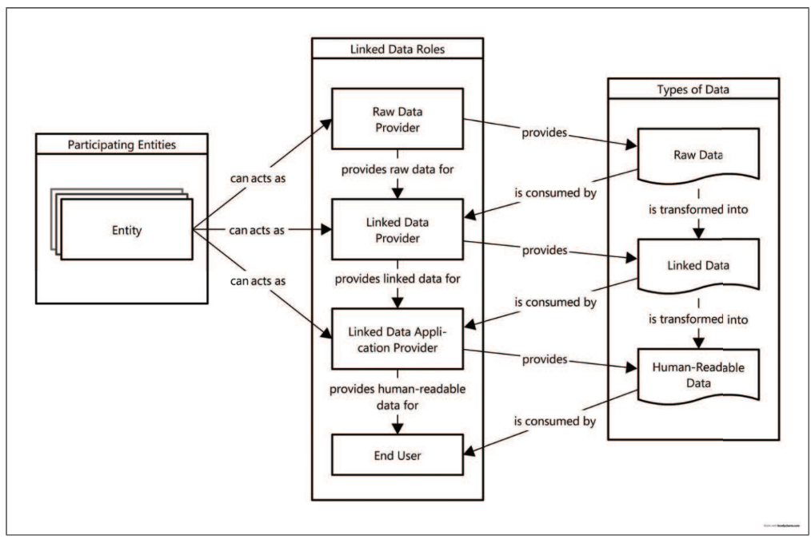
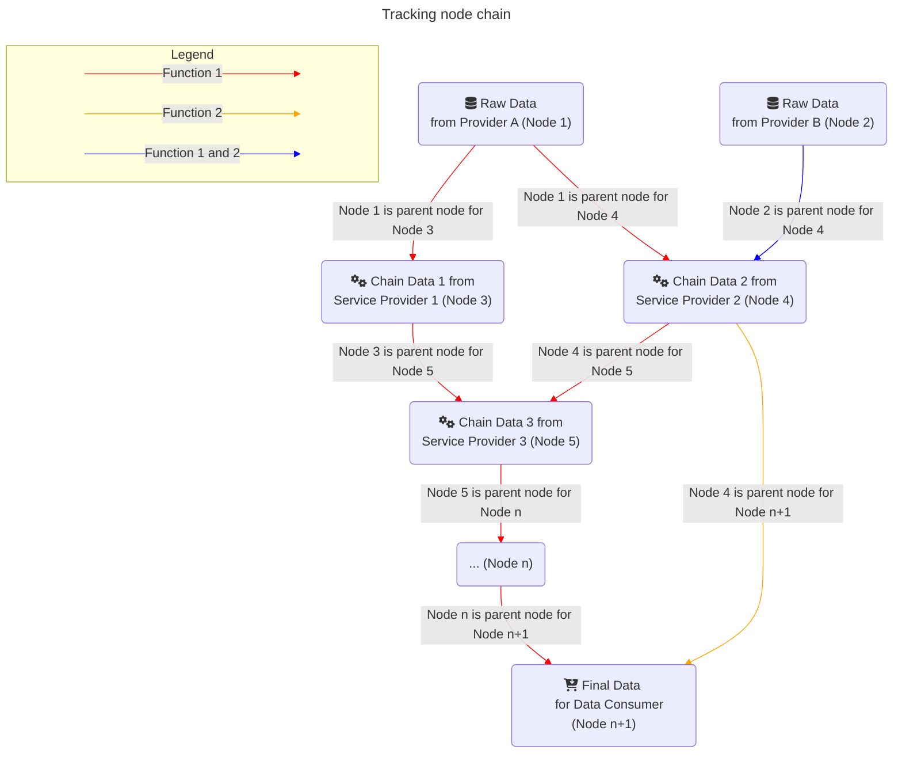
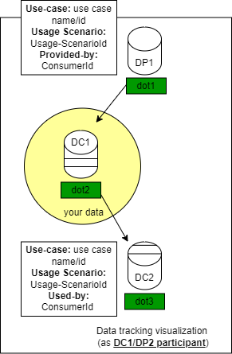
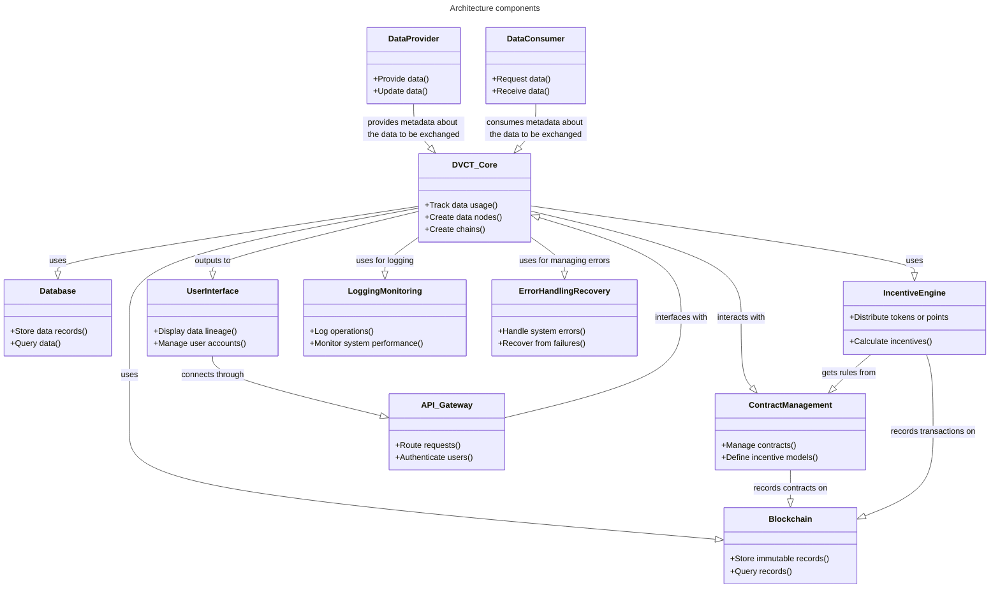
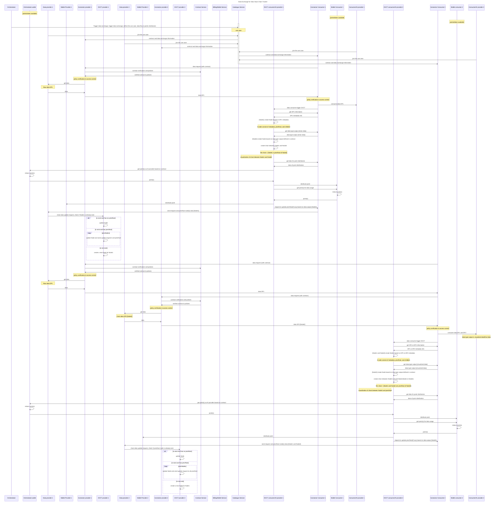
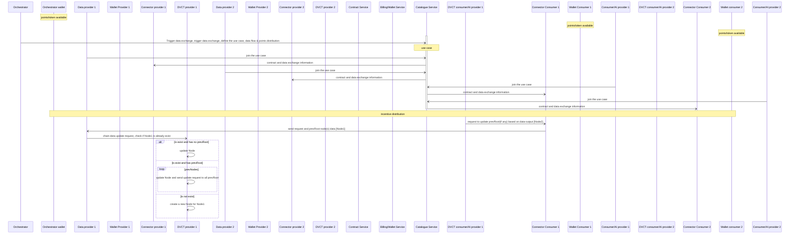
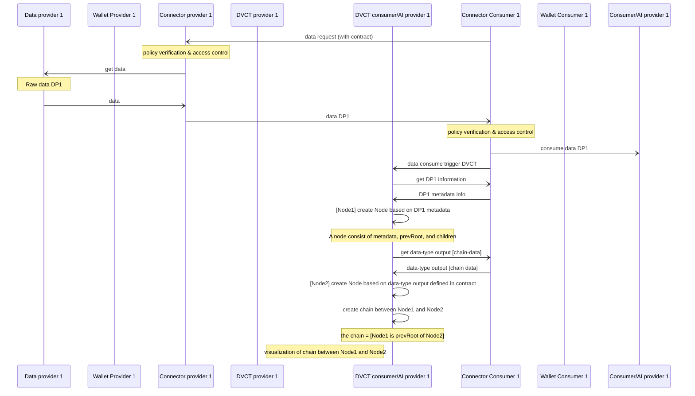
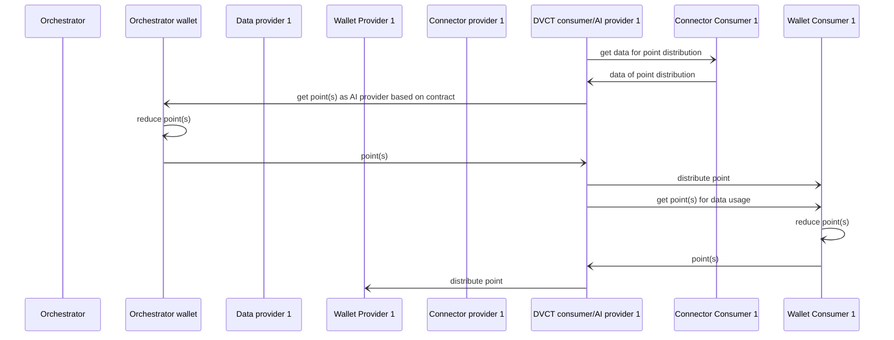
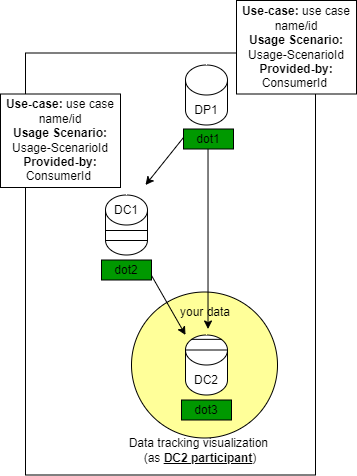
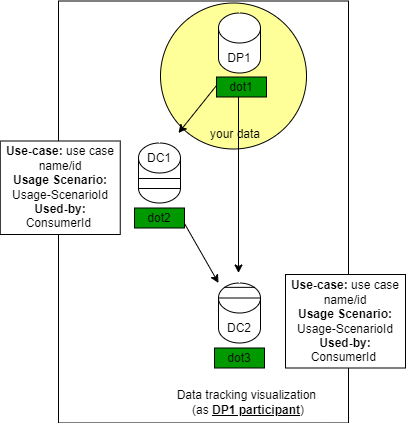

# Data value chain tracker BB – Design Document

The Data Value Chain Tracker (hereafter DVCT) is a service that monitors and distributes digital incentives for data usage. DVCT ensures traceability and accountability of data usage, as well as enables organizations and individuals to realize the value of their data.

As a data provider or data owner, DVCT allows providers to determine in which use cases, when, how, and by whom the data was used, what other data was merged together and delivered to the end user.

Data providers (individuals or organizations) get an overview of where their data is used and can obtain information about the value of their data in the ecosystem, this can help them to better negotiate their data and service offering. In addition, by tracking the use of data in the ecosystem, the DVCT will handle the distribution of digital incentive to the organizations that participate in the value co-creation of the data usage.

## Conceptual Overview

According to Latif et al. (2009), there are three different types of data that contribute to the creation of the value chain. These are raw data, linked or chain data and consumer data (human-readable). By identifying these three types of data, the DVCT can create the chain based on the parent and child nodes.


source: Linked data value chain (Latif et al., 2009)

A node represents the data processing or the activity that takes place from data provision, refinement, aggregation to end user (e.g., visualization). To construct the data usage chain node, the data origin for the data processing must be determined. Each data processing represents a child node that is connected to one or more data sources (parent nodes). A parent node can have several child nodes.
As a parent node, a data provider offers raw data, which is then processed by one or more child nodes before being delivered to the data consumer.


From the "tracking node chain" image, a use case has for example two analytics functionalities, each of these functionalities requires different Data and AI (Artificial Intelligence) Services. For the function 1, Nodes 3 and 4 are using the data directly from Node 1, while Node 5 and Node n are indirectly using the data from Node 1. These Nodes 3,4,5 or n can be regarded as a linked data provider based on the linked data value chain figure.

To encourage data sharing, digital incentives should be provided to the ecosystem. These digital incentives can be used to convert the "value" of data sharing into a valuable asset that can be used for various activities within the Prometheus-X (PTX) ecosystem. DVCT act as tool to distribute the digital incentives based on data usage of participants.

For incentives distribution, the prerequisites are:
1. The number of points (as representative of the data value) to be distributed for data and service providers must be predefined in the contract.
2. As a default, points will be awarded in full (factor = 1, factor will be between 0.0 - 1.0), unless specified in the contract to check data quality (factorCheck = false). Here, the factor will be calculated with the support of the Data Veracity Assurance building block.
3. Except for raw data, information regarding previous service data processing (based on a contract) or data origin (from dataspace catalog) must be included.
4. Incentives should be defined in a catalog, similar to the business model for dataspace offerings, where organizations can specify prices for their offers (additional input fields related to points/tokens for offers and use cases).
5. Initial points for testing purpose will be generated and given to dataspace participants.
6. Service or AI Providers should provide log data file regarding usage event, or log file about the dataset usage, training sessions, and performance the models trained with (each) dataset.

## Technical Usage Scenarios & Features

Technical usage scenario and role of the DVCT can be described to address the issue of data value ambiguity by giving an overview of data utilization, both direct and indirect:                                                                                                   
- As a use case leader, I can offer points/incentives to service providers who join my use cases to expand my network.
- As a data consumer, I can offer points or incentives to data and service (AI/building-block) providers to get better recommendations and data-driven decisions.
- As an AI service provider, I can offer points to data providers to improve my AI models.
- As a data provider, I want to know where my data is being used and what overall value I am getting from the use of my data.

There are various approaches to incentive mechanisms, including calculating the impact of data on data output (Shapley value, leave-one-out, Banzhaf value, reinforcement learning and Stackelberg game), auctions and contracts (Zeng et al., 2021). However, calculating the impact of data has its limitations: Access to the data is required, data privacy could be compromised, and high resources are required to compute and run the algorithm. This can hinder the early adoption of data spaces and building blocks. Therefore, DVCT will use contracts that do not require access to the shared data and let the market decide the value of the data.

To help Dataspace participants determine the distribution of incentives, the following are some rules that can be used as reference in the contract:

- Role-based distribution: 
    - Data providers: They receive a base percentage of incentives for providing data, with the exact percentage depending on the data relevancy to the use case, uniqueness, and size of data providers involved.
    - AI/Service Providers: receive incentives based on their role in processing, analyzing or enhancing the data, with a distribution model that takes into account the complexity and criticality of their services.
    - Use case orchestrator: Incentivized to manage and coordinate the project and ensure successful collaboration and integration between all stakeholders.
    - Data consumer: Generally receives no direct incentives, but benefits from the end product or solution.	

 
- Proportional distribution: 
    - AI/service provider: Receives a fixed number of incentive points from the use case orchestrator when joining a use case.
    - Use case orchestrator: Receives a fixed percentage of the total incentives (e.g. 10-20%), with the remaining points distributed proportionally among data providers and AI/service providers based on their number and role.

- Fixed percentage distribution: 
    - Data providers: 30-50% of total incentives.
    - AI/service provider: 30-40% of total incentives, split between providers based on their roles and contributions.
    - Use case orchestrator: 10-20% of total incentives for coordination and management.

- Quality of data input (can be also assessment from Data Veracity Assurance Building Block):
    - High: 40-50% of the data provider's share (size/volume, uniqueness, completeness, etc.).
    - Medium: 25-35% of the data provider's share.
    - Low: 15-25% of the data provider's share.
		
- Allocation of incentives based on the complexity and impact of each participant's contribution using predefined categories (AI provider roles):  
    - High impact/expected features/complexity: 40-50% of AI/service provider's share.
    - Medium impact/expected features/complexity: 25-35% of the AI/service provider's share.
    - Low impact/expected characteristics/complexity: 15-25% of the share of the AI/service provider.	

Each data provider has access to a visualization showing detailed reports on their data's usage and earned rewards.

Moreover, based on the Dataspace Governance Principles defined by IDSA (IDSA applies four core governance principles: Accountability, Transparency, Fairness and Responsibility. Source: [International Dataspace (IDSA)](https://docs.internationaldataspaces.org/ids-knowledgebase/v/idsa-rulebook/idsa-rulebook/2_guiding_principles), Contract should be clearly stated how much incentive points will be distributed among participants. The principles are join work between different BBs, and the DVCT will focus on ensuring _transparency_ and _accountability_ through an immutable database and tracking of data usage.

DVCT does not include rules on how the initial tokens are generated as this is outside the scope of building blocks, the data space that determines how DVCT can acquire tokens. Also, regarding the amount of incentives to be distributed, this is at the use case level, which will be determined by the use case participants in their business model.

### Features/Main Functionalities

Based on the DVCT objective and technical usage scenario, there are three key functionalities for the BB, the key functionalities are:

1. Track the history of direct and indirect data usage of shared data
2. Handle the distribution of digital incentives (in terms of points, tokens, badges, or labels) based on the contract.
3. Provide data for visualization of value chain tracking (forward and backward tracking).

## Requirements

The requirements for the DVCT are derived from its objectives, technical usage scenarios, the initial conceptual overview, and the guidelines from GAIA-X and IDSA. We use the term "MUST" to denote essential requirements that must be fulfilled, and "SHOULD" to indicate strong recommendations where alternative solutions may exist or because of different conditions is being applied. It’s important to note that these proposed requirements have not yet been directly validated with end users. The proposed requirements include:\*:

- **`[BB_06__01]`** DVCT MUST support tracking direct and indirect data usage
- **`[BB_06__02]`** DVCT MUST interface with the Contract
- **`[BB_06__03]`** DVCT MUST support distributed data storing the value chain data (data-usage history)
- **`[BB_06__04]`** DVCT SHOULD have access to points/token storage
- **`[BB_06__05]`** DVCT MUST store points/tokens and data-usage-history in immutable database
- **`[BB_06__06]`** DVCT SHOULD distribute points based on the contract
- **`[BB_06__07]`** DVCT SHOULD provide visualization of data value chain (data-usage history)
- **`[BB_06__08]`** DVCT SHOULD interface with the Distributed Data Visualization Building block
- **`[BB_06__09]`** DVCT MUST interface with the Data Space Connector

explanation why strong recommendation for BB_06__04: it depends on the technology and underlying architecture that being used to store the digital incentive, if thirdparty is being used as digital incentive with different mechanism DVCT should adjust, but highly recommend that DVCT has direct access to the digital incentive storage.

explanation why strong recommendation for BB_06__06: the initial design the point distribution can also later be from other aspect that is not always define directly in the contract. but here we highly recommend to use distribution based on the dataspace contract.

explanation why strong recommendation for BB_06__07 and BB_06__08: The visualization can also be just a table or a JSON data format, which depends on the user/data provider if they want to visualize the data in a readable form in their frontend or also use building blocks to visualize the usage data.

## Distribution of incentives in DVCT

The objective of the distribution of incentives in the DVCT is to design and implement a system for distributing incentives within a data value chain tracker using blockchain and smart contracts. The orchestrator or other entity will provide the tokens/points based on the contract, and the DVCT system will distribute the tokens/points to providers and consumers.

### Incentive for network participants

DVCT will incentivize data providers, AI providers, and contributing consumers based on their contribution to the use case. It will largely operate based on contracts provided by use-case orchestrators. Smart contracts ensure fairness, transparency, and security in the distribution of tokens. The DVCT also hope to see potential for new incentives and business models, exploring novel ways to incentivize and capitalize on existing data flows.

### Smart contracts

The smart contracts will facilitate the distribution of tokens. Some of its parameters will be defined from the contract bb, which defines information about a participant’s role, data usage terms, type of data usage and the distribution of points. This ensures consistency and interoperability across the Prometheus-X ecosystem. This needs to monitor the direct and indirect use of data for a given use case to be able to distribute tokens correctly. The mechanisms for payment and incentive distributions are integrated directly into the smart contracts, ensuring fair and transparent compensation for data providers based on the value of their contributions. The DVCT might need to collaborate with some use-case orchestrators to define the contract parameters accurately, considering the specific requirements of each use case.

### Blockchain
The DVCT has made the choice to build on an EVM-compatible blockchain. The Ethereum Virtual Machine (EVM) offers the developers significant advantages, especially in terms of familiarity, interoperability, and access to a broad ecosystem. It serves as the backbone of the Ethereum network, where it has been battle-tested, and its compatibility has been widely adopted by numerous other blockchain, creating a standardized environment for decentralized applications. More specifically, the DVCT will be building on Polygon, which is a layer-2 scaling solution for Ethereum. This gives you the security and robustness of Ethereum, whilst enhancing scalability and throughput, and drastically lowering the transaction fees. Since Polygon is fully EVM-compatible you have all the other advantages of building on Ethereum like strong developer tools, ecosystem support, battle-tested contract standards etc. However, since the system is built on an EVM blockchain, it does not suffer a strong lock-in effect, and has the freedom to switch to another EVM-compatible blockchain in the future. This might be needed in the case that another building block decides to use blockchain technologies, need to communicate with the DVCT, and they have some specific requirements leading them to use another blockchain. Communicating between contracts on different blockchains often requires complex bridging solutions and additional layers of coordination. As long as they are on an EVM-compatible blockchain it is possible to coordinate and switch blockchain without much developer cost. 

### Data visibility

The DVCT system ensures that data visibility is maintained through transparent and auditable processes. Each data transaction and incentive distribution is recorded on the blockchain, providing an immutable and verifiable ledger of all activities. This transparency helps all participants verify the accuracy and fairness of incentive distribution. To minimize transaction fees you should always store as little information as possible in the actual blockchain. The DVCT will just be storing some metadata from the contract that defines how the incentive will be distributed, and the actual records of distribution. This is not considered sensitive data.

### Incentive Token

The Incentive Token is an ERC-20 token that will be utilized within the DVCT system to reward participants for their contributions. As an ERC-20 token, it adheres to a widely accepted standard on the Ethereum blockchain, ensuring compatibility with various wallets, exchanges, and decentralized applications.

- Standard Compliance: The Incentive Token follows the ERC-20 standard, which defines a common interface for fungible tokens on Ethereum. This ensures interoperability with existing Ethereum-based infrastructure and services, allowing seamless integration and usage across the ecosystem.

- Wallet Compatibility: Being an ERC-20 token, the Incentive Token is compatible with a wide range of Ethereum wallets, including popular options like MetaMask and Trust Wallet. This provides users with flexibility in managing their tokens. 

### Responsibilities

The DVCT is responsible for distributing the incentives and storing metadata about how the incentives should be distributed in the blockchain.
- It is responsible for the component that listens to events that signify a reward should be distributed, and then calls the smart contract for the actual distribution.
- It is responsible for the smart contract that handles distribution and communication with wallets as described in the section above.
- The DVCT facilitates the distribution process by working with the contract BB, which handles any adjustments needed in the dataspace contract creation. The contract creator will simply connect their wallet and sign a message to make some tokens available for the DVCT smart contract.

**Error handling**
The DVCT is also responsible for handling errors, particularly in the distribution of incentives. The following error handling mechanisms ensure that the incentives are delivered correctly.

**Key Features of the Error Handling Algorithm:**
 
- Validation and verification: Ensures that only valid data and rules are used for distribution.
- Error detection: Automated detection of anomalies through threshold checks and exception handling.
- Logging and notification: Errors are logged for audit purposes and participants are notified if required.
- Rollback and correction: Mechanism to undo incorrect distributions and correct them either automatically or manually.
- Continuous improvement: Feedback is used to improve the algorithm over time and reduce the likelihood of similar errors.

This approach ensures that the incentive distribution process is robust, transparent, and able to handle errors efficiently while maintaining fairness and accuracy.

Example scenario: An error is discovered in which an AI service provider receives 10 points less than intended due to an incorrect calculation of its point contribution.

**Steps Taken:**

1. **Detection:** Automated threshold alerts identify the discrepancy immediately after the distribution (compare points on participant side with expected points to receive; compare number of points to distribute with total distributed points).
2. **Rollback:** The initial incorrect distribution is rolled back.
3. **Automatic Review:** A automatic review by the point based on the contract. If required, manual review should be performed by the building block provider and identifies that the error was due to incorrect data input regarding the miss calculation metrics.
4. **Correction:** The metrics are corrected, and the incentive distribution is recalculated.
5. **Re-distribution:** The correct points (10 additional points) are allocated to the AI/Service Provider.
6. **Notification:** All participants are informed of the error, the cause, and the correction process.
7. **Feedback and Improvement (optional):** The process is reviewed, and the rule validation system is updated to prevent similar errors in the future.

By applying these error handling mechanisms, the incentive distribution process ensures that it is fair, transparent, and resilient to discrepancies, ensuring that all participants are appropriately rewarded for their contributions to the data and the data end-result.

### Additional points

#### Token Revocation
A mechanism to revoke tokens from actors who violate contract terms or engage in fraudulent activities. Implemented in incentive component and smart contract. For this to be possible the tokens can not be directly transferred to the actors wallet, but rather allocated to them for later verification.

#### Fiat conversion
The conversion of tokens to fiat is out of scope for the DVCT building block. This functionality should be defined by the dataspace, possibly through integration with payment gateways or exchange services.

### Example Incentives

To better understand how points can be distributed in the ecosystem, let's take a look at example incentives that could be used.
* As a use case orchestrator, I can provide X points to the Data or Service Provider when they join my use case
* As a use case orchestrator, I can provide X points to a Data Provider after a successful transaction
* As a Data Provider, I can provide X points to a Service Provider after a successful response from their service

> These are only a sample of all the incentives that could be used for token distribution with the DVCT

To simulate the incentive distribution, let's consider three different scenario and apply different incentive distribution rules to scenarios related to training and skills management, where participants include data providers, AI/service providers, and use case orchestrators. In these scenarios, the focus is on how data and AI services are utilized to enhance training programs and manage skills development, with 100 points to be distributed among the participants (points are provided by data consumer).

**Scenario 1: One Data Provider and One AI/Service Provider**
Scenario Overview:

- Data Provider: An educational institution providing historical training data, including course completion rates, exam results, and student feedback.
- AI/Service Provider: A company that uses the data to develop a personalized learning algorithm to enhance the training program.

Incentive Distribution:

- Data Provider: 60 points (60% of the total points).
Rationale: The educational institution's data is critical for developing the personalized learning algorithm. Since they are the sole provider of the data, they receive the majority share.
- AI/Service Provider: 40 points (40% of the total points).
Rationale: The AI/service provider’s role in developing the personalized algorithm is crucial, but since they rely on the provided data, they receive a smaller share than the data provider.

**Scenario 2: One Data Provider, Several AI/Service Providers, and Use Case Orchestrator**
Scenario Overview:

- Data Provider: A corporate training department provides employee performance data, including training history, skills assessments, and feedback scores.
- AI/Service Providers:
    - AI Provider 1: Develops a predictive model to identify employees at risk of skill gaps.
    - AI Provider 2: Builds a recommendation engine for personalized training paths.
    - Service/Building block Provider: Refine and prepare the result of AI models into the company’s Learning Management System (LMS).
- Use Case Orchestrator: An HR consulting firm defines the project, coordinates the providers, and ensures the solution aligns with corporate goals.

Incentive Distribution:

- Data Provider: 30 points (30% of the total points).
Rationale: The corporate training department’s data is foundational for the AI models. However, since there are multiple contributors, the data provider receives a smaller share.
- AI Provider 1: 20 points (20% of the total points).
Rationale: The predictive model is essential in identifying skill gaps, earning a significant share.
- AI Provider 2: 20 points (20% of the total points).
Rationale: The recommendation engine adds substantial value by tailoring training paths, thus sharing an equal portion with AI Provider 1.
- Service Provider: 15 points (15% of the total points).
Rationale: The integration work is critical for implementation but less complex than the AI models, so it receives a slightly smaller share.
- Use Case Orchestrator: 15 points (15% of the total points).
Rationale: The orchestrator plays a vital role in ensuring the success of the project, justifying this share.

**Scenario 3: Multiple Data Providers, One Service Provider**

Scenario Overview:

- Data Providers:
    - Data Provider 1: An online learning platform provides data on user engagement, including course completion rates and time spent on each module.
    - Data Provider 2: A corporate HR department provides employee skills assessments and training records.
    - Data Provider 3: A certification body provides data on professional certifications and exams passed by employees.
- Service provider: A professional aggregation service integrates the datasets to create a comprehensive skills dataset.

Incentive Distribution:

Data Provider 80 Points:
- Data Provider 1: 36 points (45% of the total points for Data provider).
Rationale: The online learning platform’s engagement data is vital for understanding how users interact with training content, earning a significant share.

- Data Provider 2: 24 points (30% of 80 points).
Rationale: The HR department’s data is crucial for correlating training with performance, justifying this share.

- Data Provider 3: 20 points (25% of the 80 points).
Rationale: The certification data adds value by validating the skills learned, though it plays a somewhat supporting role.

- Service provider: 20 points (20% of the total points).
Rationale: The orchestrator’s role in integrating diverse datasets and ensuring the platform meets the corporation’s needs is highly complex and critical, warranting the largest share.

**Summary of Distribution in Points:**
*Scenario 1 (One Data Provider, One AI/Service Provider):*
- Data Provider: 60 points
- AI/Service Provider: 40 points

*Scenario 2 (One Data Provider, Several AI/Service Providers, Use Case Orchestrator):*
- Data Provider: 30 points
- AI Provider 1: 20 points
- AI Provider 2: 20 points
- Service/BB Provider: 15 points
- Use Case Orchestrator: 15 points

*Scenario 3 (Multiple Data Providers, Service provider, Use Case Orchestrator):*
- Data Provider 1: 36 points
- Data Provider 2: 24 points
- Data Provider 3: 20 points
- Service Provider: 20 points

These examples show how the 100 points can be distributed in training and skills management scenarios, ensuring that each participant is fairly rewarded based on their role and contribution.

## Integrations

In order to make the BB function, the integration with other BB is expected:

### Direct Integrations with Other BBs

- _Catalog._\
  The DVCT requires input fields in the catalog for providers to specify the number of points they offer or expect for their data or services, similar to how price input fields are used to define monetary values in the catalog and contract.

- _Contract._\
  The DVCT needs to get data from the contract about the contract identifier, the data used/transferred and the share of the distribution of digital incentives. The information forms the basis for the distribution of digital incentives after the data usage process.

- _Distributed data visualization._\
  The DVCT will provide node and chain data that need to be visualized to the data owner, this will help data owner to get overview regarding the value/usefulness of their data within different use case or PTX data space. The visualization can be shown in different places for example in the catalog.

- _Data veracity assurance._\
  The data veracity BB will focus on the data quality. Even though the DVCT
  will not access the data that is being shared between participants, it will
  work with metadata. It might be relevant to assess the quality of the data based on the information contained in the metadata itself, according to some agreed criteria set in the metadata being checked, such as completeness, data anonymity, timeliness, etc. We should also consider the possibility of automating this process if this falls within the scope of this BB.

### Integrations via Connector

- In line with the hybrid approach of the PTX dataspace connector, DVCT will need to be integrated directly into the **Connector** to extend the data exchange flows and perform the smart contract process to update the DVCT containing the value chain. In line with the hybrid approach of the PTX dataspace connector, DVCT needs to be directly integrated into the connector to extend the data exchange streams and to execute the smart contract process for updating the DVCT with the value chain. To trigger DVCT, a URI to the DVCT need to be included in the configuration of the connector.
  Where applicable the **Connector** will ping DVCT for token distribution before making data accessible.

## Relevant Standards

- To ensure node uniqueness, universal unique identified (UUID) can be used. It can be UUID based on MD5 hash 128-bit or in case of decentralized services a [Decentralized identifiers (DIDs)](https://w3c.github.io/did-core/) to allow verifiable identity.
- [ISO 8000-117](https://www.iso.org/standard/81208.html) for data quality and data immutability (including if needed distributed ledger Blockchain)
- [ERC-20](https://ethereum.org/en/developers/docs/standards/tokens/erc-20/) for token standards on the Ethereum blockchain. This widely adopted standard ensures compatibility and interoperability of fungible tokens across different applications and platforms within the Ethereum ecosystem.

### Data Format Standards

- [JSON-LD](https://json-ld.org/) for data interconnection
- [ISO 8601](https://en.wikipedia.org/wiki/ISO_8601) for Date and time format

### Mapping to Data Space Reference Architecture Models

**DSSC** - based on DSSC, this Building block is part:

- [Data Provenance Tracking](https://docs.internationaldataspaces.org/ids-knowledgebase/v/ids-ram-4/perspectives-of-the-reference-architecture-model/4_perspectives/4_1_security_perspective/4_1_6_usage_control#data-provenance-tracking) architecture model
- the [Provenance & Traceability](https://dssc.eu/space/BVE/357075283/Provenance+%26+Traceability) building block
- [Value-Added Services](https://dssc.eu/space/BVE/357076468/Value-Added+Services) building block.
- [GAIA-X: Technical Architecture](https://www.bmwk.de/Redaktion/EN/Publikationen/gaia-x-technical-architecture.pdf?__blob=publicationFile&v=7) regarding data ecosystem in section 4.2

**IDS Data Sharing and data exchange:** see [2.4 Data Exchange and Data Sharing](https://docs.internationaldataspaces.org/ids-knowledgebase/v/ids-ram-4/context-of-the-international-data-spaces/2_1_data-driven-business_ecosystems/2_4_data_exchange_and_data_sharing).

## Input

### Input data:

```json
{
  "dvctId": "connector_id",
  "usecaseContractId": "use_case_contract_id",
  "usecaseContractTitle": "use_case_contract_title",
  "extraIncentiveForAIProvider": {
    "numPoints": 10,
    "factor": 1,
    "factorCheck": false
  },
  "contractId": "contract_id",
  "dataId": "data_id",
  "dataProviderId": "data_provider_id",
  "dataConsumerId": "data_consumer_id",
  "dataConsumerIsAIProvider": false,
  "prevDataId": "data_id",
  "incentiveForDataProvider": {
    "numPoints": 5,
    "factor": 1,
    "factorCheck": false
  }
}
```

### Data Value Chain Tracker visualization

- Visualization of value tracking for data provider. This visualization maps how data flows across use cases and entities within the dataspace, highlighting its contribution to decision-making and revenue/digital incentive generation. Designed for transparency and accountability, it can be shown as hierarchical or triple-marble format where each node reveals detailed data usage. The goal is to provide an accessible overview of the data lifecycle and its value. An example is shown below.
  

### Data Value Chain Tracker digital incentives distribution

The distribution of digital incentives distribution should be based on the contract, defined by the use case orchestrator or between data provider and data consumer. Example of incentives json input defined within the contract:

**incentive for AI provider**

```json
{
  "extraIncentiveForAIProvider": {
    "numPoints": 10,
    "factor": 1.0,
    "factorCheck": false
  }
}
```

**incentive from data consumer to data provider**

```json
{
  "incentiveForDataProvider": {
    "numPoints": 5,
    "factor": 1.0,
    "factorCheck": false
  }
}
```

To further develop the integration of other aspects (e.g. data quality) for the incentive mechanism, the factor percentage (0.0 to 1.0) and the factorCheck object are added. By default, the incentive points are awarded in full (factor = 1,0) and without further checking of the incentive effect.

## Architecture

### Component Descriptions:

1. **DataProvider:** Entities that supply data to the use case and provide metadata about the data.
2. **DataConsumer:** Entities that use data provided by DataProviders and get the metadata.
3. **DVCT_Core:** Central logic component that tracks data usage, creates metadata nodes and chains between data usage nodes.
4. **Blockchain:** Ensures data immutability and transaction verification.
5. **Database:** Stores non-blockchain data records and manages queries.
6. **UserInterface:** Provides visualizations of data lineage, data usages information, points/token information and manages user interactions.
7. **ContractManagement:** Manages digital contracts that define incentive models.
8. **API_Gateway:** Manages all incoming and outgoing API requests and handles user authentication.
9. **Incentive Engine:** Handles the calculation and distribution of tokens or points as per contractual agreements.
10. **Logging and Monitoring:** Records system activities and monitors performance to ensure optimal operation and aid in troubleshooting.
11. **Error Handling and Recovery:** Implements strategies to manage system errors and restore normal operations after failures, ensuring system resilience and reliability.



## Dynamic Behaviour

The sequence diagrams below describe possible DVCT to the basic B2B Connector flows.



The sequence diagram shows the current possibilities for the use case orhcestrator to confirm the organization's participation for their use case independently at one time, or different times, to give them more possibilities to understand the offer and negotiate the contract. To make the diagram smaller, more manageable parts, ensuring it remains comprehensible and easy to follow on smaller screens, we divided the process into different main processes:

- **Part 1:** Initiating Data Exchange and Basic Data Handling



- **Part 2:** Data Usage and Node Creation



- **Part 3:** Incentive Distribution and Chain Update



## Configuration & Deployment Settings

The configuration and deployment setting for Data Value Chain Tracker (DVCT), consist of:

1. Repository Setup: the source code will be hosted on GitHub or GitLab, allowing for version control and collaborative development.
2. Configuration Management: Environment variables for sensitive or environment-specific settings (e.g., database credentials) should be centralized in specific files, employ configuration files (like config.json, .env, or YAML files) to manage application settings, which can be easily adjusted without changing the code.
3. Dependency Management: Utilize a package manager such as npm for JavaScript or pip for Python to manage libraries and their versions. a requirements.txt or package.json file should be included to automate the installation of dependencies.
4. Database Configuration: Set up a relational or NoSQL database with scripts for initialization and migration. Tools like Docker can be used to containerize database environments, enhancing portability and consistency across development, testing, and production environments.
5. Deployment:Use continuous integration/continuous deployment (CI/CD) pipelines via GitHub Actions, to automate testing and deployment. Use container orchestration tools like Kubernetes or Docker Swarm.
6. Monitoring and Maintenance: Implement logging and monitoring using tools like Prometheus, Grafana, or ELK Stack to keep track of the system’s health and performance. Regular updates and security patches to dependencies should be managed through the chosen package managers and monitored via the CI/CD pipeline.

## Third Party Components & Licenses

- Blockchain:
  Component: Polygon (Ethereum layer-2 scaling solution).
  License: Most tools and libraries in the Polygon ecosystem are open-source and are typically licensed under the MIT License or Apache License 2.0. These licenses permit free use, modification, and distribution.

- MongoDB Node.js Library:
  Component: MongoDB Node.js driver for database operations.
  License: The MongoDB Node.js library is released under the Apache License 2.0.

## OpenAPI Specification

The current specification can be found [here](/docs/diagrams/OpenAPI.yml).

## Test Specification

### Test Plan

The test plan for the Data Value Chain Tracker (DVCT) aims to ensure the system's integrity and performance through a comprehensive approach. It includes correctness tests for accurate data representation, reliability tests for system stability and data integrity, tests data immutability and scalability, back and forward tracking tests to verify accurate data lineage, and incentives distribution tests to ensure compliance and fairness based on contractual agreements.

To check the result of the value chain creation, the DVCT should create a node for the data usage in **output data** json format after the data is used on the data consumer side (PDC consumer will trigger DVCT). Each time information about the prevDataId is present in the input data, the DVCT checks whether the prevDataId already exists (as a nodeId) within the value chain node. If this is the case, the childNode of the prevDataId is updated with the new dataId as a child node.

DVCT testing scenario can be found [here](/docs/DVCT%20testing%20scenario.md).

**Output data:**

```json
{
  "nodeId": "node_id",
  "dataId": "data_id",
  "nodeMetadata": {
    "dvctId": "connector_id",
    "usecaseContractId": "use_case_contract_id",
    "dataProviderId": "data_provider_id",
    "dataConsumerId": "data_consumer_id",
    "incentiveReceivedFrom": [
      {
        "organizationId": "organization_id",
        "numPoints": 5,
        "contractId": "contract_id"
      },
      {
        "organizationId": "organization_id",
        "numPoints": 5,
        "contractId": "contract_id"
      }
    ]
  },
  "prevNode": [
    { "nodeId": "node_id", "@nodeUrl": "https://url-to-nodeId/nodeId" },
    { "nodeId": "node_id", "@nodeUrl": "https://url-to-nodeId/nodeId" }
  ],
  "childNode": [
    { "nodeId": "node_id", "@nodeUrl": "https://url-to-nodeId/nodeId" },
    { "nodeId": "node_id", "@nodeUrl": "https://url-to-nodeId/nodeId" }
  ]
}
```

### Back and forward chain tracking

Back and forward chain tracking in the context of the Data Value Chain Tracker (DVCT) refers to the system's ability to trace data usage throughout its lifecycle. Forward tracking enables monitoring of how data is used, transformed, or combined from its initial state to subsequent states, including indirect usages in various use cases. It helps determine where, when, and in which use case the data was utilized.

Backward tracking, on the other hand, allows tracing back to the data's origin up to three levels, identifying the primary source and any intermediate stages it has passed through. This feature ensures transparency and accountability in data handling, allowing stakeholders to see both the downstream implications of data they provide and the upstream origins of data they use. This capability is critical for auditability, compliance, and verifying the integrity of data transformations and linkages in complex systems.

- For backend and forward tracking testing, user can check the origin of the data:
  <br><br>
  
- The output json file will contain prevNode that list all parent node, each parent node will also contain the same node metadata to track the parent node. Also, the forward tracking can show where the data is already being used based on the child node:
  <br><br>

### Component-level testing

These tests will check the interactions between DVCT and external systems like the Data Space Connector and Contract Service to ensure data flows correctly through the system and meets all business requirements.

### Incentives Distribution Tests:

Test the logic and execution of digital incentives distribution to ensure it complies with the contractual agreement. Simulate various contractual scenarios to ensure incentives are calculated and distributed accurately and transparently.

## Partners & roles

**imc AG ([website](https://www.im-c.com)):**
As Building Block Lead, responsible for leading the design of the DVCT Building Block, drafting the initial design specifications for value tracking and ensuring that the development is in line with Prometheus-X and other Dataspaces standards such as IDSA and GAIA-X. imc AG is responsible for these components:

- DVCT_Core
- Data usage history
- API_Gateway (together with Vision)

**Visiontrust ([website](https://visionspol.eu/)):**
Responsible in the implementation phase, preparing the development environment for the DVCT, ensuring smooth communication and interaction of the DVCT with the corresponding building blocks and the PTX dataspace connector. Identification of data processing input and output. Visiontrust will take the lead in developing these components for the DVCT:

- API_Gateway (together with imc AG)
- Logging and Monitoring
- Contract Management
- User Interface

**Nomadlabs ([website](https://nomadlabs.no/)):**
Responsible in the implementation phase for incentivizing data usage, integration of smart contracts, value-chain and blockchain technology within the DVCT. Overall, Nomadlabs will manage the development of these components for the DVCT:

- Blockchain interaction
- Incentive Engine

Each partner is responsible for error handling and correction within the developed components.

## Usage in the dataspace

DVCT is useful for tracking data usage and can thus provide greater benefit to members of the data space. DVCT will support the skills service chain and not only help data providers recognize the value of their data to business and society, but also distribute incentives across the network.

### Reference

- Latif, A., Saeed, A. U., Hoefler, P., Stocker, A., & Wagner, C. (2009, September). The Linked Data Value Chain: A Lightweight Model for Business Engineers. In I-SEMANTICS (pp. 568-575).
- Zeng, R., Zeng, C., Wang, X., Li, B., & Chu, X. (2021). A comprehensive survey of incentive mechanism for federated learning. arXiv preprint arXiv:2106.15406. https://arxiv.org/pdf/2106.15406
