# Data veracity assurance BB – Design Document

> [!TIP]
> When in doubt regarding the intended meaning of a certain term, refer to the [Glossary](#glossary).

The Data Veracity Assurance building block (_DVA_ from now on) allows data exchange participants to agree on and later [prove](#g_proof)/verify quality requirements or properties of the exchanged data.

For example, if a [data producer](#g_p) (abbreviated _P_ from now on) provides simple sensor data to a [data consumer](#g_c) (_C_ from now on), DVA can facilitate [P](#g_p) to [prove](#g_proof) (or at least [claim](#g_att)) and [C](#g_c) to verify that the provided data is credible (e.g., temperature values are within a certain range, say in the interval _(-100 °C, +50 °C)_).

DVA requires a [**veracity level agreement (VLA)**](#g_vla) between the exchange participants.
This agreement is part of the contract and targets a specific data exchange unit (instance).
The [VLA](#g_vla) defines a number of **veracity objectives** that each describe a **data quality aspect** (e.g., _completeness_ or _accuracy_) and an **evaluation scheme** (e.g., value is within a numerical range).
The [VLA](#g_vla) also defines _how_ the evaluation is to be performed (e.g., with a certain algorithm or software library).
When the data exchange occurs, in the simplest model, [P](#g_p) attaches an [attestation](#g_att) (or even a [proof](#g_proof)) regarding the exchanged data’s quality that [C](#g_c) can verify and trust.

The high-level concepts of the DVA BB have been summarized in the knowledge graph below.
The second graph visualizes a concrete example of using DVA in a use case where [xAPI] training data is exchanged.

<!-- Hacking a Mermaid flowchart for a knowledge graph for now -->

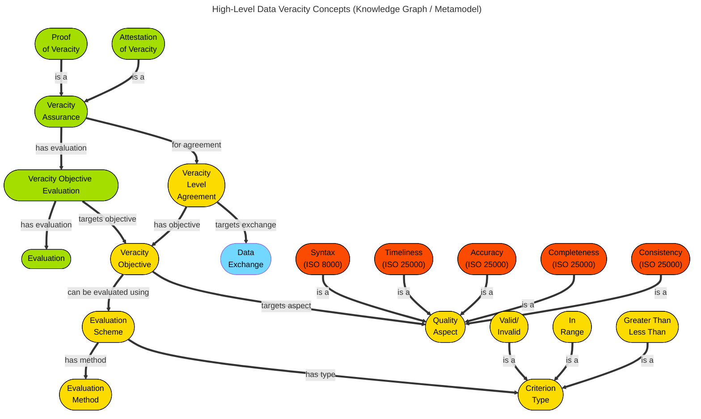

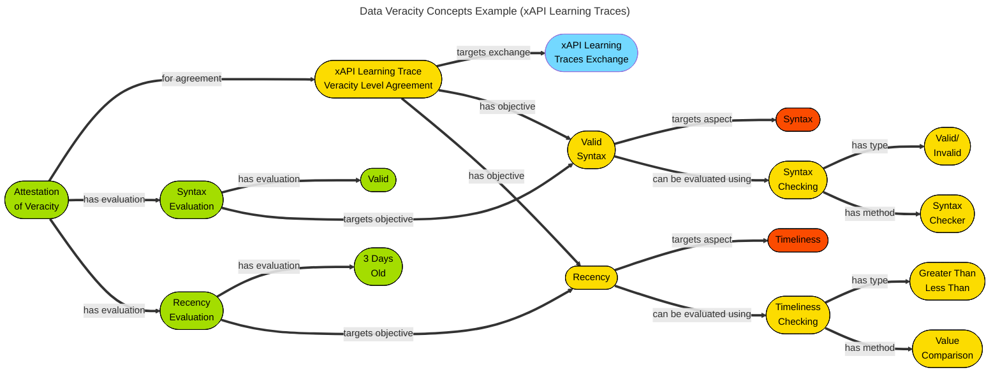


## Technical Usage Scenarios & Features

### Features/Main Functionalities

Key functionalities:
1. Manage data veracity level agreements ([VLAs](#g_vla))
   * more precisely: provide [VLA](#g_vla) [templates](#g_template) (to the [Contract Manager] BB) for inclusion in new contracts
2. Provide means to…
   * [attest to](#g_att)
   * [prove](#g_proof)
   * verify

   the [veracity](#g_dv) of exchanged data
3. Log veracity verification results

Optional functionalities:
* [Proving](#g_proof)/verifying data properties that are related to further _sensitive_ (e.g., due to GDPR) data _without disclosing the sensitive data_
* Decentralized DVA architecture
* Partial [attestations](#g_att) or [proofs of veracity](#g_pov)
* Handling of disagreements between [P](#g_p) and [C](#g_c)

### Technical Usage Scenarios

The technical usage scenarios have been summarized in the following UML use case diagram.

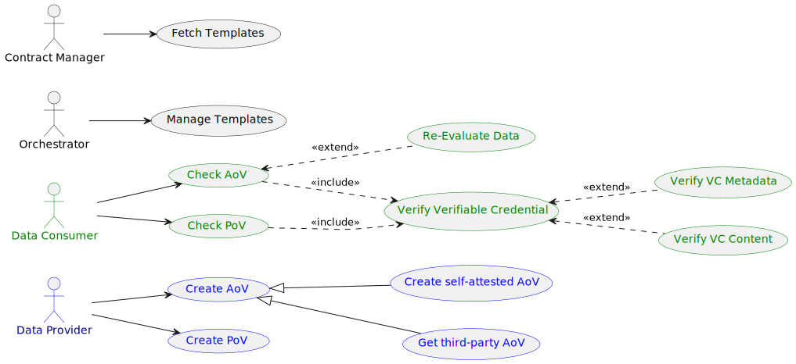

* **Fetch Templates:** the [Contract Manager] component can get the currently available list of [VLA](#g_vla) [templates](#g_template) (which are essentially data quality requirement templates; e.g., how many `NaN` values a dataset contains and how to count them) for inclusion in the [VLAs](#g_vla) of new contracts
* **Manage Templates:** the data space [orchestrator](#g_orch) has the right to select what [templates](#g_template) can be used in the data space.
  The DVA BB provides an initial list of available [templates.](#g_template)
  For testing purposes, DVA will provide a simple GUI where [templates](#g_template) can be managed (created, removed, edited, etc.).
* **Create [AoV](#g_aov):** [P](#g_p) can create an [_attestation_](#g_att) saying that the shared data complies to the [VLA.](#g_vla)
  * **Create third-party [AoV](#g_aov):** in this case a trusted third party [attests to](#g_att) the data’s [veracity](#g_dv)
  * **Create self-attested [AoV](#g_aov):** alternatively, the [provider](#g_c) themselves may [attest to](#g_att) the data’s [veracity](#g_dv)
  * You can find more information about [AoV](#g_aov)s [later in this document](#attestations-of-veracity-aovs).
* **Create [PoV](#g_pov):** [P](#g_p) can also create a [_proof_](#g_proof) that the data fulfils the requirements in the [VLA.](#g_vla)
  * Proofs are different from [attestations](#g_att) as they do not require trust from [C](#g_c) in either [P](#g_p) or a third party.
  * Read more about [PoVs](#g_pov) [later in this document](#attestations-of-veracity-aovs).
* **Verify Verifiable Credential:** both [AoV](#g_aov)s and [PoVs](#g_pov) are issued as [verifiable credentials](https://www.w3.org/TR/vc-data-model-2.0/).
  Upon the receipt of an [AoV](#g_aov) or [PoV,](#g_pov) [C](#g_c) can verify these documents.
  * **Verify VC Metadata:** this refers to checking of the [verifiable credential](#g_vc) itself (for a valid cryptograhic signature, schema, etc.).
  * **Verify VC Content:** this refers to checking what is encoded in the _subject_ of the [verifiable credentials.](#g_vc)
    For example, in the context of a [PoV,](#g_pov) a [_proof_](#g_proof) (which could be a small binary object) is included in the file.
    This [proof](#g_proof) can be directly (and noninteractively) verified by [C](#g_c).
* **Check [AoV](#g_aov):** [AoV](#g_aov)s are based on trust, but [C](#g_c) should still check the [attestation](#g_att) ‘document’ itself for validity (a [_verifiable credential_](#g_vc)).
* **Check [PoV](#g_pov):** [PoVs](#g_pov) are meant to be verified by [C](#g_c).
  If the [proof](#g_proof) is deemed valid, it is impossible for [P](#g_p) to have generated it based on invalid data.
* **Re-Evaluate Data:** In case of an [AoV](#g_aov), [C](#g_c) may still wish to redo the same calculations and checks that [P](#g_p) (or a third party) claims to have done.

#### Templates for Veracity Level Agreements (VLAs)

[VLAs](#g_vla) describe exactly what data quality [P](#g_p) ‘promises’ and/or [C](#g_c) expects.
The format and exact contents of [VLAs](#g_vla) is further detailed later in this document.

While [VLAs](#g_vla) are struck and primarily managed by the [Contract Manager], DVA supports the process by managing [VLA](#g_vla) [templates](#g_template).
The dataspace [orchestrator](#g_orch) is authorized to select the set of [templates](#g_template) whose usage is allowed in the dataspace.

DVA of course also provides the means for [P](#g_p) to [prove](#g_proof) (or [attest](#g_att)) and [C](#g_c) to verify that the exchanged data fulfils the requirements set by the [VLA](#g_vla); see below.

#### <a name=povsaovs></a>Proving, Attestation, and Verification of Veracity

We approach [veracity](#g_dv) compliance assurance as a challenge at the intersection of technology and trust.

There are chiefly two ways [P](#g_p) can offer [veracity](#g_dv) assurance regarding the exchanged data:
1. By presenting an [**Attestation of Veracity (AoV)**](#g_aov)
2. By presenting a [**Proof of Veracity (PoV)**](#g_pov)

---

In some cases, [VLAs](#g_vla) do not need to be supported by an explicit [AoV](#g_aov)/[PoV](#g_pov) at all: the [VLA](#g_vla) serves as a kind of a [‘data contract’][data contract] where [C](#g_c) takes on the responsibility of checking compliance on receiving data.

The primary deficiency of this ‘trust, but verify’ model is that [C](#g_c) may not be willing, or even capable to (fully) check compliance with a [VLA](#g_vla).
[Attestations of veracity](#g_aov) provide a **trust-based** solution to establish compliance without consumer-side checking.

We distinguish two major categories of [attestations](#g_att):

1. **Third-party** [attestations of veracity](#g_aov) follow the normal trust-based claim [attestation](#g_att) pattern; the usual concerns of the third party being trustworthy by [C](#g_c) certainly apply here.
   Verification of these attestations will typically not go further than establishing the validity of the claim as a valid and non-revoked [verifiable crendetial (VC)](#g_vc).
2. We also allow for **‘self-attestation’** by [P](#g_p).
   Trust-wise, the additional assurance carried by self-attestations (note that a [VLA](#g_vla) is already a commitment by [P](#g_p)) is that [P](#g_p) is able to communicate partial or full results of the [veracity](#g_dv) evaluation performed by them in such [attestations](#g_att).
   In general, this can be valuable for ‘hard to compute, easy to verify’ evaluations (e.g., [NP-complete](https://en.wikipedia.org/wiki/NP-completeness) decision problems on the data); but in practice, we expect this mechanism to increase confidence in [C](#g_c) through showing compliance for a sample of the data.

**[Proofs of veracity (PoVs)](#g_pov),** on the other hand, establish compliance through cryptographic, and not trust-based approaches – when this is required and feasible.
Such [proofs](#g_proof) are _sound,_ meaning that a cheating [P](#g_p) cannot forge a [PoV](#g_pov) for a piece of data that does not adhere to the [VLA](#g_vla)’s requirements.
(Mathematically and succinctly) verifiable zero-knowledge as well as non-zero knowledge [proofs](#g_proof) on data have been an emerging field of mathematics in the last two decades, with increasingly rapid development in the last few years.
However, as algorithms, standards, software frameworks, and use cases are still evolving, the DVA building block will provide a highly extensible framework for [PoVs](#g_pov), driven by the use cases of the project.

DVA defines what [proofs](#g_proof) and [attestations](#g_att) are (see [later in this document](#attestations-of-veracity-aovs) and provides means to generate [PoVs,](#g_pov) [AoVs,](#g_aov) and to verify veracity.

#### Logging of Results

DVA also keeps track of veracity verification results for traceability and auditing purposes.


## Requirements

* **`[BB_08__01]`** DVA MUST define schemata for [VLAs](#g_vla)
* **`[BB_08__02]`** DVA MUST provide [VLA](#g_vla) [templates](#g_template)
* **`[BB_08__03]`** DVA SHOULD support editing available [VLA](#g_vla) [templates](#g_template)
* **`[BB_08__04]`** DVA MUST support striking [VLAs](#g_vla)
* **`[BB_08__05]`** DVA MUST provide multiple [veracity](#g_dv) assurance methods
* **`[BB_08__06]`** DVA MUST support [veracity](#g_dv) [attestation](#g_att) (i.e., either [P](#g_p) or a third party [attests](#g_att) that [veracity](#g_dv) requirements are met)
* **`[BB_08__07]`** DVA SHOULD support [veracity](#g_dv) [self-attestation](#g_att)
* **`[BB_08__08]`** DVA SHOULD support third-party [veracity](#g_dv) [attestation](#g_att)
* **`[BB_08__09]`** DVA SHOULD support [provider](#g_p)-[proven](#g_proof) [veracity](#g_dv)
* **`[BB_08__10]`** DVA SHOULD support [consumer](#g_c)-verified [veracity](#g_dv)
* **`[BB_08__11]`** DVA MUST interface with the [Contract Manager] service
* **`[BB_08__12]`** DVA MUST interface with the [Dataspace Connector]
* **`[BB_08__13]`** DVA MUST log verification results

```mermaid
---
title: DVA Requirements
---

requirementDiagram
  requirement BB_08__01 {
    id: BB_08__01
    text: "DVA MUST define schemata for VLAs"
    risk: medium
    verifymethod: demonstration
  }
  requirement BB_08__02 {
    id: BB_08__02
    text: "DVA MUST provide VLA templates"
    risk: medium
    verifymethod: demonstration
  }
  requirement BB_08__03 {
    id: BB_08__03
    text: "DVA SHOULD support editing available VLA templates"
    risk: low
    verifymethod: demonstration
  }
  functionalRequirement BB_08__04 {
    id: BB_08__04
    text: "DVA MUST support striking VLAs"
    risk: medium
    verifymethod: test
  }
  functionalRequirement BB_08__05 {
    id: BB_08__05
    text: "DVA MUST provide multiple veracity assurance methods"
    risk: low
    verifymethod: demonstration
  }
  functionalRequirement BB_08__06 {
    id: BB_08__06
    text: "DVA MUST support veracity attestation"
    risk: low
    verifymethod: demonstration
  }
  functionalRequirement BB_08__07 {
    id: BB_08__07
    text: "DVA SHOULD support veracity self-attestation"
    risk: low
    verifymethod: demonstration
  }
  functionalRequirement BB_08__08 {
    id: BB_08__08
    text: "DVA SHOULD support third-party veracity attestation"
    risk: low
    verifymethod: demonstration
  }
  functionalRequirement BB_08__09 {
    id: BB_08__09
    text: "DVA SHOULD support provider-proven veracity"
    risk: medium
    verifymethod: demonstration
  }
  functionalRequirement BB_08__10 {
    id: BB_08__10
    text: "DVA SHOULD support consumer-verified veracity"
    risk: medium
    verifymethod: demonstration
  }
  interfaceRequirement BB_08__11 {
    id: BB_08__11
    text: "DVA MUST interface with the Contract Manager service"
    risk: medium
    verifymethod: test
  }
  interfaceRequirement BB_08__12 {
    id: BB_08__12
    text: "DVA MUST interface with the Dataspace Connector"
    risk: medium
    verifymethod: test
  }
  functionalRequirement BB_08__13 {
    id: BB_08__13
    text: "DVA MUST log verification result"
    risk: medium
    verifymethod: test
  }

  BB_08__02 - refines -> BB_08__01
  BB_08__03 - refines -> BB_08__01
  BB_08__06 - refines -> BB_08__05
  BB_08__07 - refines -> BB_08__06
  BB_08__08 - refines -> BB_08__06
  BB_08__09 - refines -> BB_08__05
  BB_08__10 - refines -> BB_08__05
```


## Integrations

### Direct Integrations with Other BBs

_No direct integrations._

### Integrations via the [Dataspace Connector]

* As [VLAs](#g_vla) will be part of the contracts, DVA will have interactions with the **[Contract Manager]** component (e.g., to fetch the current [VLA](#g_vla))
* DVA will integrate with the **[Dataspace Connector]** itself to extend data exchange flows with [veracity](#g_dv) assurance steps
* DVA will also have integrations with the **[Data Value Chain Tracker]** BB
  * The _value_ is strongly related to the quality of the data assured by DVA


## Relevant Standards

### Data Format Standards

* [VLAs](#g_vla) will be encoded in [YAML](https://yaml.org/) (and embedded in contracts).
* DVA will parse and/or serialize into [JSON](https://www.json.org/) or [JSON-LD](https://json-ld.org/) files for interoperability.
* For configuration, DVA will use [TOML](https://toml.io/en/).

### Other Standards

There are ISO standards that define data-quality-related concepts:
* [ISO 8000-61:2016](https://www.iso.org/standard/63086.html) – Data Quality – Part 61: Data quality management: Process reference model
* [ISO/IEC 25000:2014](https://www.iso.org/standard/64764.html) – Systems and software engineering – Systems and software Quality Requirements and Evaluation (SQuaRE)

Other possibly relevant standards and specifications:
* [Data Contracts](https://datacontract.com/), which are very similar to [VLAs,](#g_vla) have a [standard](https://github.com/bitol-io/open-data-contract-standard)

[PoVs](#g_pov) and [AoVs](#g_aov) are planned to be manifested as [W3C _verifiable credentials_ (VCs)](https://www.w3.org/TR/vc-overview/):
* [W3C Verifiable Credentials Data Model v2.0](https://www.w3.org/TR/vc-data-model-2.0/)

### Mapping to Data Space Reference Architecture Models

**DSSC:** see the [Value-Added Services](https://dssc.eu/space/BVE/357076468/Value-Added+Services) building block.

**IDS RAM:** see [4.3.6 Data Quality](https://docs.internationaldataspaces.org/ids-knowledgebase/v/ids-ram-4/perspectives-of-the-reference-architecture-model/4_perspectives/4_3_governance_perspective/4_3_7_data_quality) in the Governance Perspective.


## Input / Output Data

### Data Veracity Level Agreements (VLAs)

> [!NOTE]
> The precise language of [VLAs](#g_vla) is still being worked out.
> This should not be a concern to other components such as the [Contract Manager] at this point, as [VLAs](#g_vla) are expected to be embedded into the contracts.
> Take, for example, the [Bilateral Contract example](https://github.com/Prometheus-X-association/contract-manager/wiki/Bilateral-Contract-%E2%80%90-Example): the mockup [VLA](#g_vla) could be added to this contract under an additional `vla` key (with some minor modifications and after converting the YAML to JSON of course).

Initial mockup [VLAs](#g_vla) based on [data contracts][data contract]:

```yaml
---
id: urn:vla:example:vrtraces
meta:
  title: VR Learning Traces VLA Example
  version: 0.1.0
  description: |
    A simple Veracity Level Agreement (VLA) example based on the
    VR Learning Traces building block.
  exchange: cdef77c9-4016-45bb-868d-6f014e17ed2d


models:
  trace:
    description: A VR learning trace
    type: xapi
    xapi_extensions:
      - http://example.com/exercises/b9e16535-4fc9-4c66-ac87-3ad7ce515f5c/sensors/score


objectives:

  - name: xapi_syntax
    description: Data is a valid xAPI JSON file
    aspect: syntax
    evaluation:
      method:
        id: syntax_check
        args:
          checker: xapi
      type: valid_invalid

  - name: 1w_freshness
    description: Learning trace is not too old
    aspect: timeliness
    evaluation:
      method:
        id: timestamp_comparison
        args:
          timestamp: xapi_timestamp
          within: 1w
      type: in_range

  - name: new_user
    description: No data has been supplied about this actor in the past
    aspect: uniqueness
    evaluation:
      method:
        id: uniqueness_check
        args:
          target: actor.id
      type: valid_invalid
```

```yaml
---
id: urn:vla:example:moodle
meta:
  title: Moodle Learning Traces VLA Example
  version: 0.1.0
  description: |
    A simple Veracity Level Agreement (VLA) example for Moodle-like xAPI
    data
  exchange: bb54352d-3da4-4b6d-a4db-3639003f5f99


models:
  trace:
    description: xAPI trace
    type: xapi


objectives:

  - name: is_dases
    description: Trace is within the subset defined by Gaia-X DaSES
    aspect: schema
    evaluation:
      method:
        id: xapi_schema_dases
      type: valid_invalid
```

### Attestations of Veracity (AoVs)

[AoVs](#g_aov) (and [PoVs](#g_pov)) will manifest as [verifiable credentials.](#g_vc)
The information graph that summarizes the contents of these [credentials](#g_vc) can be seen below.

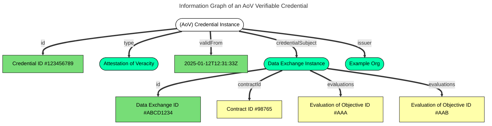

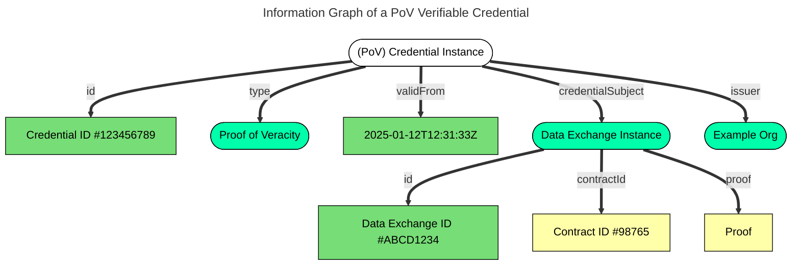

For [AoVs,](#g_aov) specifying concrete evaluation results is optional.
The important elements of an [attestation](#g_att) are its issuer and the identifiers of the relevant data exchange (and contract).

For [PoVs,](#g_pov) the [_proof_](#g_proof) is a crucial element of the credential.


## Architecture

### High-Level Architecture

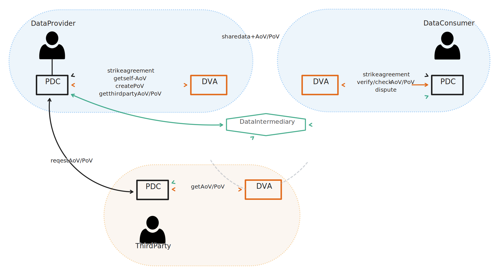

### Internal Software Architecture

<!-- Abusing Mermaid's flowcharts... -->

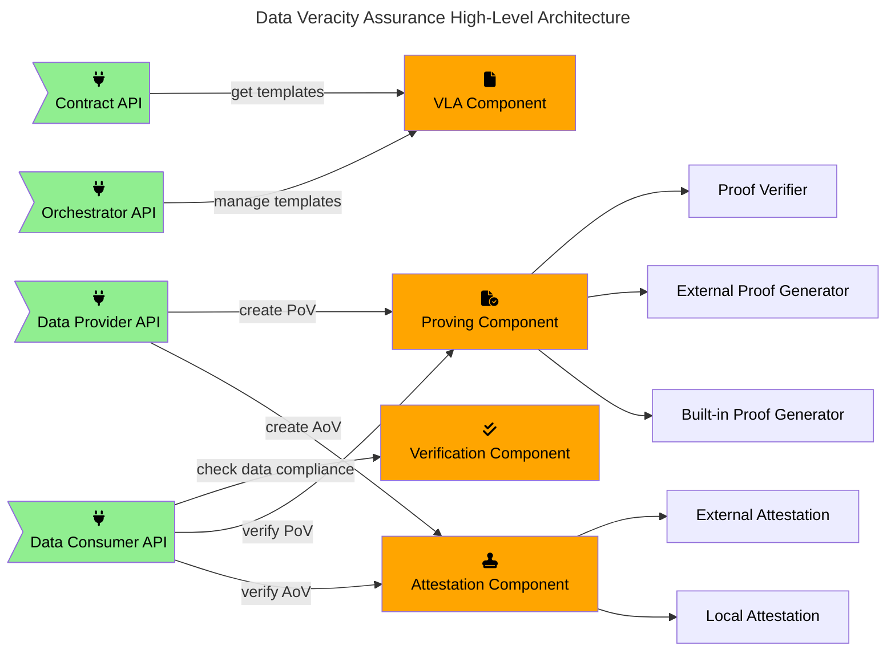


## Dynamic Behaviour

The sequence diagrams below describe possible DVA additions to the basic [Connector][Dataspace Connector] flows.

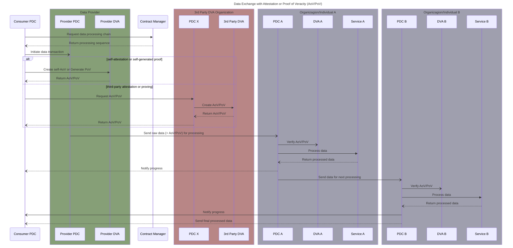


## Configuration & Deployment Settings

The data space [orchstrator](#g_orch) may configure some basic aspects of DVA, such as…
* what [templates](#g_template) are available to use in [VLAs](#g_vla)
* whether both [AoVs](#g_aov) and [PoVs](#g_pov) are available
* for [AoVs](#g_aov): what [attestation](#g_att) methods (third-party, self-) are allowed
* logging verbosity

### Error Scenarios

The main potential error scenarios of DVA are caused by not being able to access the data for which [AoVs](#g_aov) or [PoVs](#g_pov) should be generated or verified and by possible limitations in resources required to generate [AoVs](#g_aov) and [PoVs](#g_pov).

#### Unavailable Data

To be able to generate an [AoV](#g_aov) or a [PoV](#g_pov), DVA needs access to the data under assessment.
Incomplete or corrupted data may also not be possible to properly analyze.
[AoVs](#g_aov) and [PoVs](#g_pov) must ‘prove’ that they have been created based on the right data to be valid and reliable (this can be most simply accomplished by ‘committing’ them to a checksum).

Access to the data may be necessary not only for _generation_ by [P](#g_p) but also for _verification_ by [C](#g_c).
This is only relevant in the case of [PoVs](#g_pov), which are verifiable [proofs](#g_proof) that a given piece of data fulfils the [VLA](#g_vla) – the [proof](#g_proof) can only be checked if the original data is available.

#### Resource Limitations

Some DVA operations may require surprisingly high computational power.
This is especially true for [PoVs](#g_pov), which are inherently more complex than [AoVs](#g_aov).

Furthermore, DVA will not be prepared to handle extreme workloads and will likely start thrashing above a certain limit of request frequency.


## Third-Party Components & Licenses

For [verifiable-credentials-related](#g_vc) operations, DVA will rely on:
* [Credo](https://credo.js.org/) ([Apache 2.0])
* [walt.id](https://walt.id/) ([Apache 2.0])

For performing veracity checks, DVA will use:
* [Great Expectations](https://greatexpectations.io/) ([Apache 2.0])

Other potential, less important libraries planned to be used by the implementation:
* [toml4j](https://github.com/mwanji/toml4j) for [TOML](https://toml.io/en/) serialization ([MIT])
* [GenSON](https://github.com/wolverdude/GenSON) for [JSON](https://www.json.org/) serialization ([MIT])
* [snakeyaml](https://github.com/snakeyaml/snakeyaml) for [YAML](https://yaml.org/) serialization ([Apache 2.0])
* [ktor](https://github.com/ktorio/ktor) for the REST API ([Apache 2.0])

## Implementation Details

The core functionality of DVA will be implemented over the JVM in Java/Kotlin.
Some [verifiable-credential](#g_vc)-related functionality will be implemented in TypeScript.


## OpenAPI Specification

The current specification can be found in [`spec/openapi.yaml`](https://github.com/Prometheus-X-association/data-veracity/blob/main/spec/openapi.yaml).


## Test Specification

### Test Plan

The primary objective of testing will be to validate the correct handling of exchanged data compliant and non-compliant with the quality aspects established in the [VLA.](#g_vla)
Several data examples (including correct and incorrect samples) will be used for these tests.
Various data quality aspects will be targeted and case studies will be conducted using different data types used in the main project use cases, like VR traces ([xAPI]), Moodle learning traces ([xAPI]), and skills (ontology/terminology).

The integration with the [Dataspace Connector] component will be tested thoroughy to verify that the necessary interactions are indeed possible and that error cases are handled properly (e.g., when no data is received during a data exchange or data _is_ received but without a [PoV](#g_pov)/[AoV](#g_aov) even though it would be required).

While DVA will not directly integrate with the [Contract Manager] component, it should be tested that DVA can recognize [VLA](#g_vla) fragments defined in the contracts and that it is possible to extend existing contracts with [VLA](#g_vla) fragments.
In the end, this functionality will be provided by (or at least _via_) the _Catalogue,_ not this BB.

Furthermore, interactions with other components, such as the [Data Value Chain Tracker (DVCT)][Data Value Chain Tracker] will be validated through testing, as these potentially involve new interactions, protocols, and interfaces.

The DVA BB test acceptance critieria are, informally, and without striving for completeness:
* [VLAs](#g_vla) can be struck and parsed from contracts.
* DVA correctly handles data fulfilling the criteria in the corresponding [VLA](#g_vla) as well as data that is non-compliant.
* DVA can successfully communicate with the [Dataspace Connector] and be a part of the data exchange flow.
* [AoVs](#g_aov) and [PoVs](#g_pov) can be created via DVA.
* No [PoVs](#g_pov) can be created for data that does not fulfil the [VLA.](#g_vla)
<!--- 
### Internal Unit Tests

_TBD_

### Component-level Testing

_TBD_

### UI test

_TBD_
-->

## Partners & Roles

[BME](https://www.bme.hu/) (the BB leader) shall design and implement DVA.


## Usage in the Data Space

DVA may be involved in various service chains and use cases.
So far, the following usages have been identified.

### Learning Records BB: Sharing LMS/Moodle Data for Visualization

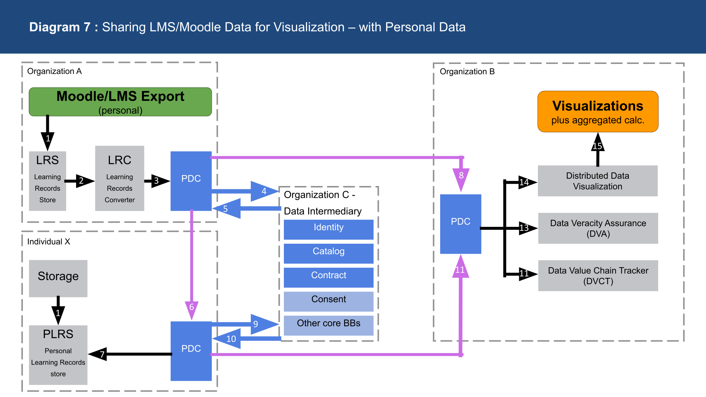

### Skill Scenarios

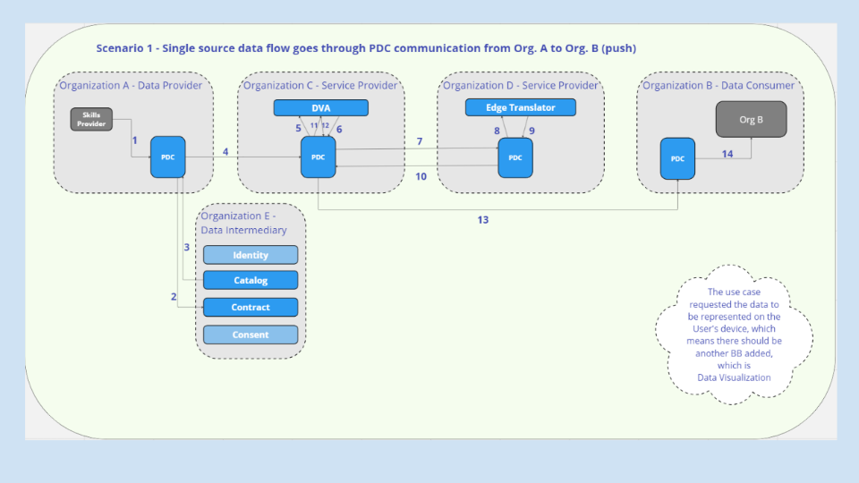


## Abbreviations Used

| Abbreviation | Expansion |
| :--- | :--- |
| DVA | data veracity assurance building block |
| [VLA](#g_vla) | [veracity level agreement](#g_vla) |
| [P](#g_p) | [data producer](#g_p) |
| [C](#g_c) | [data consumer](#g_c) |
| [PoV](#g_pov) | [proof of veracity](#g_pov) |
| [AoV](#g_aov) | [attestation of veracity](#g_aov) |

## Glossary

<dl>
  <dt><a name=g_att href=#>attestation</a></dt>
  <dd>
    <q>the issue of a statement, based on a decision, that fulfillment of specified requirements has been demonstrated</q> (<a href=https://www.iso.org/standard/73029.html>ISO/IEC 17000:2020</a>)
    <br>
    In DVA, <em>attestations</em> of veracity (AoVs) are statements made by either <a href=#g_p>P</a> or a third party rearding the fulfilment of the <a href=#g_vla>VLA</a>.
    While <a href=#g_pov>PoVs</a> are meant to be verified, <a href=#g_aov>AoVs</a> are based on trust.
  </dd>

  <dt><a name=g_aov href=#>attestation of veracity</a></dt>
  <dd>
    <i>refer to <a href=#povsaovs>Proving, Attestation, and Verification of Veracity</a></i>
  </dd>

  <dt><a name=g_c href=#>data consumer</a></dt>
  <dd>
    <q>a transaction participant to whom data is, or is to be technically supplied by a <a href=#g_p>data provider</a> in the context of a specific data transaction</q> (<a href=https://dssc.eu/space/Glossary/176554052/2.+Core+Concepts>DSSC Glossary v2.0 2023-09 2. Core Concepts:</a> <em>Data Recipient</em>)
  </dd>

  <dt><a name=g_p href=#>data producer</a></dt>
  <dd>
    <q>a transaction participant that, in the context of a specific data transaction, technically provides data to the <a href=#g_c>data recipients</a> that have a right or duty to access and/or receive that data</q> (<a href=https://dssc.eu/space/Glossary/176554052/2.+Core+Concepts>DSSC Glossary v2.0 2023-09 2. Core Concepts:</a> <em>Data Provider</em>)
  </dd>

  <dt><a name=g_dv href=#>data veracity</a></dt>
  <dd><q>completeness and/or accuracy of data</q> (<a href=https://www.iso.org/obp/ui/#iso:std:iso-iec:20546:ed-1:v1:en>ISO/IEC 20546:2019</a> 3.1.16)</dd>

  <dt><a name=g_orch href=#>orchestrator</a></dt>
  <dd>
    <q>
      A data space participant that represents and is accountable for a specific use case in the context of the governance framework.
      The orchestrator establishes and enforces business rules and other conditions to be followed by the use case participants.
    </q>
    (<a href=https://dssc.eu/space/Glossary/176554052/3.+Data+space+use+cases+and+business+model>DSSC Glossary v2.0 2023-09 3. Data space use cases and business model:</a> <em>Use case orchestrator</em>)
  </dd>

  <dt><a name=g_proof href=#>proof</a></dt>
  <dd>
    <q>a fact or piece of information that shows that something exists or is true</q> (<a href=https://dictionary.cambridge.org/dictionary/english/proof>Cambridge Dictionary</a>)
    <br>
    In DVA, <em>proofs</em> of veracity (PoVs) are special data that demonstrate the fulfilment of the <a href=#g_vla>VLA</a> and can be verified by <a href=#g_c>C</a>.
    While <a href=#g_aov>AoVs</a> require trust, <a href=#g_pov>PoVs</a> can be directly verified.
  </dd>

  <dt><a name=g_pov href=#>proof of veracity</a></dt>
  <dd>
    <i>refer to <a href=#povsaovs>Proving, Attestation, and Verification of Veracity</a></i>
  </dd>

  <dt><a name=g_template href=#>template</a></dt>
  <dd>
    templates are possible elements to use in <a href=#g_vla>VLAs</a>
  </dd>

  <dt><a name=g_vc href=#>verifiable credential</a></dt>
  <dd>
    <q>a verifiable credential is a tamper-evident credential that has authorship that can be cryptographically verified</q> (<a href=https://www.w3.org/TR/vc-data-model-2.0/#terminology>W3C Verifiable Credentials Data Model 2.0</a>)
    <br>
    <strong>credential:</strong>
    <q>
      A set of one or more claims made by an issuer.
      The claims in a credential can be about different subjects.
      The definition of credential used in this specification differs from, NIST's definitions of credential.
    </q>
    <br>
    <strong>claim:</strong>
    <q>An assertion made about a subject.</q>
  </dd>

  <dt><a name=g_vla href=#>veracity level agreement</a></dt>
  <dd>
    an agreement regarding the <a href=#g_dv>data veracity</a> requirements of a specific data exchange
  </dd>

  <dt><a name=g_vo href=#>veracity objective</a></dt>
  <dd>
    a single requirement in a <a href=#g_vla>veracity level agreement</a>
  </dd>
</dl>


<!-- Reference links (will not be rendered) -->
[xAPI]: https://xapi.com/
[Contract Manager]: https://github.com/Prometheus-X-association/contract-manager
[Dataspace Connector]: https://github.com/Prometheus-X-association/dataspace-connector
[Data Value Chain Tracker]: https://github.com/Prometheus-X-association/data-value-chain-tracker
[data contract]: https://github.com/bitol-io/open-data-contract-standard
[Apache 2.0]: https://opensource.org/license/apache-2-0
[MIT]: https://opensource.org/license/mit
