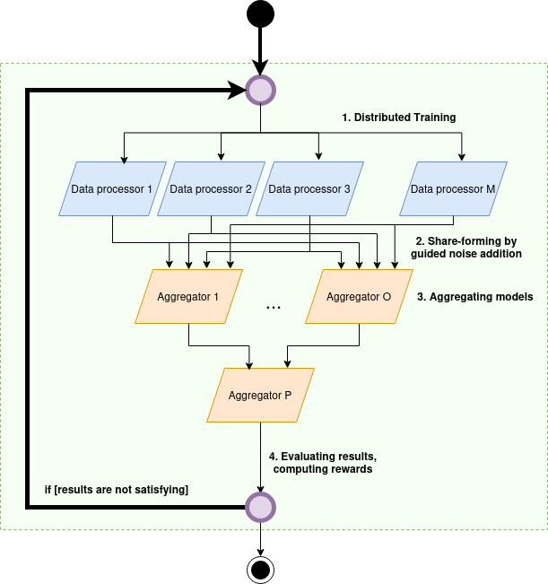
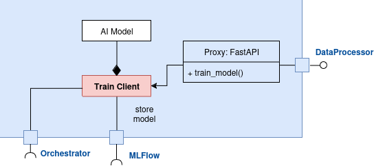
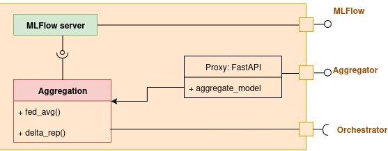
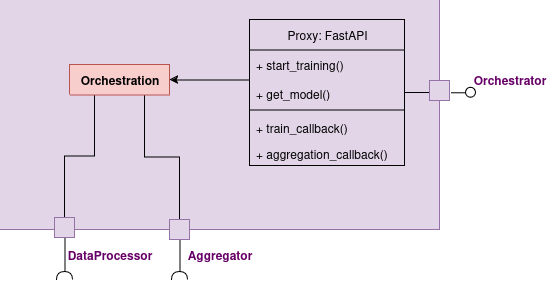

# Decentralized AI building block architecture

The architecture of the decentralized AI training building block follows the *micro services architecture* design pattern. That allows a strong decoupling of components and offers flexibility in deployment.

## Roles and Stakeholders
Three stakeholders, registered entities of the PTX-Catalog, participate in this service:
- *Data providers* (data sources) who have a data offer. Before using the decentralized AI training service, data providers shall aggree on a common AI model architecture (including the definition of its input features and its output).
-  *BB01* provides corresponding federated learning algorithms for contracted partners.
- [*Building Block 02 (Edge Computing) - BB02*](https://github.com/Prometheus-X-association/edge-computing/tree/main) provides technical background for the system. (I.e., it provides a Kubernetes-cluster)

The stakeholders shall make project contracts to be able to use BB01.

The above stakeholders have various roles in operating the decentralized AI training service:
- *Installer* role: installers configure and set up BB02's cluster system. (Setting up BB02 includes downloading data from data providers and deploying BB01's algorithms.) The installer registers the deployment to the BB01 API endpoint's registry. The installer can also remove the deployment if it is no longer maintained.
- *Training initiator* role: training initators shall define actual training architecture, and they can start the decentralized AI training process.
- *Model user* role: model users can download and use the trained federated model.

Naturally, any of the data providers can fulfill these roles.

### Internal System Components:
Besides external stakeholders, BB01 consists of three types of internal components:
- *Data processors* have compute capability to train local models. Upon request, they train their local model on the data of their corresponding data provider's data.
- *Aggregators* are responsible for aggregating local models coming from data processors. Aggregators can have a tree structure, leading to a hierarchal structure with a top level aggregator.
- *Orchestrator* is a helper components that calls data processors' and aggregators' functions.

Between these components, BB02 provides secure communication. BB02 also provides geofencing by deploying data processors into prescribed servers.

## High-level system overview



1. Data processsors are responsible for local AI training on data providers' data. After training the actual model update, they create a number of variants $1..O$ of this model by systematically adding noise to the updated model. These model versions are called *shares*.
2. Aggregators can have a hierarchal structure. The low-level integrators are connected to the data processors. The aggregators compute an aggregated model. The top-level aggregator in the aggregation structure constructs the actual federated model.
3. The performance of the federated model is evaluated after each communication round. If the results are not satisfying, data processors download the latest federated model, and repeat the training process.

The shares shall be constructed in such a manner that the aggregators can cancel out all of the noise. Therefore, we will have a noise-free federated model without model performance hindering.

## Component design

Following the microservices philosophie, each of the below components are containerized into a `Docker` container. They provide a `FastAPI` interface through which the components are available.

### Data processors



Data processors provides a core functionality, i.e., training the local AI model. The AI model is customizable; hence, users can replace it with their own implementation.

Data providers provides an interface for model training. This interface is not supposed to be public, it only serves internal communication with the Orchestrator.

This component stores its output in the corresponding aggregators' `MLFlow` server. It also notifies the orchestrator if the model training is finished.

### Aggregators



Aggregators compute intermediary or global federated models. They provide an interface through which the aggregation procedure (either a FedAvg or a DeltaRep type aggregation can be requested). This interface is not intended to be public, it only serves internal communication with the Orchestrator.

One instance of this component type, the final aggregator, provides a public `MLFlow` server access. Model users can connect to this server to download the federated model. Moreover, model users and training initators can check performance metrics displayed in this MLFlow server.

### Orchestrator


Orchestrator is a controller component of the microservices system. It provides a public interface towards BB01 API, to be able to start training process, or get access to the latest federated model version.

Through the orchestrator interface, aggregators and data processors can notify the orchestrator component about job completion through callback functions.

## BB01 API

BB01 API is the component that is registered into the PTX catalogue. It also connects to the orchestrator's interface.

BB01 API and actual depyloments are *disjoint*, and the API can function as a registry of BB01 deployments. It allows stakeholders to create and publish multiple federated learning system deployments in the Prometheus-X dataspace.

It provides the following functions through a FastAPI interface (also accessible as PTX data offers):

### **Component access**
`get_algorithm_credentials(ptx_contract_id) -> credentials`

With a signed contract ID, this function returns credentials to the installer for downloading BB01 components from a docker repository. Note that certain parts of the core functionality (i.e., the AI model) can be a protected intellectual property.

This function returns, e.g., an access token:
```json
{
    "ghcr_token": "xiojdghdgkjdhg3284578257klgansdfgkn2354"
}
```

### **Register deployment**

`register_deployment(ptx_contract_id, deployment_dict)`

installers shall register their deployment to provide access to contracted partners (e.g., fellow data providers, model users, training initiators). For endpoint registration, installers shall provide resource URIs and necesarry credentials in the `deployment_dict`, e.g.:
```json
{
    "orchestrator_uri": "https://orchestrator.mydeployment.company.com",
    "orchestrator_credentials":
    {
        "username": "my_orchestrator_user",
        "password": "my_orchestrator_password"
    },
    "mlflow_uri": "https://mlflow.topaggregator.mydeployment.company.com",
    "mlflow_credentials":
    {
        "username": "my_mlflow_user",
        "password": "my_mlflow_password"
    }
}
```
### **Get orchestrator access**

`get_orchestrator_access(ptx_contract_id)`

Training initators can carry this API endpoint to obtain the URL and ncessary credentials to the deployewd Orchestrator to start the training process.

The server returns the following json:

```json
{
    "orchestrator_uri": "https://orchestrator.mydeployment.company.com",
    "orchestrator_credentials":
    {
        "username": "my_orchestrator_user",
        "password": "my_orchestrator_password"
    }
}
```

### **Get MLFLow access**
 `get_federated_mlflow_access(ptx_contract_id) -> resource_uri, credentials`
 
 With a signed contract ID, this function returns URI and credentials to model users for the final aggregator's MLFlow server. Through this access, model users can downlaod the latest model version, and check its performance metrics.

The server returns the following json:

```json
 {
    "mlflow_uri": "https://mlflow.topaggregator.mydeployment.company.com",
    "mlflow_credentials":
    {
        "username": "my_mlflow_user",
        "password": "my_mlflow_password"
    }
}
```

### **Remove deployment**

`remove_deployment(ptx_contract_id)`

If a training process completed, and stakeholders wish to remove the deployment, it is the installer's responsibility to remove the deployment from BB01 API's registry.

Attention, once a deployment is removed, it will no longer be available to other participants.