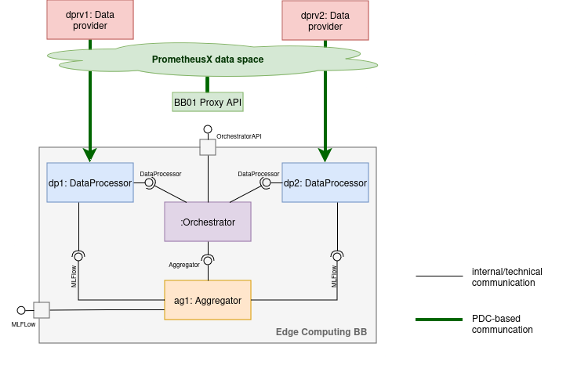

# BB01 Demos

## Demo1 - Minimal working example
In this setup, we demonstrate a minimal working example of BB01 building on BB02's Kubernetes Cluster, running on [BME's cloud infrastructure](https://fured.cloud.bme.hu/dashboard/vm/26552/).

For BB02's description, you can check [BB02 - Edge Computing for Training](https://github.com/Prometheus-X-association/edge-computing/tree/main/kubernetes/deployment/training) documentation.

This demo features two data processors and one aggregator. Data processors and data providers can communicate through the PTX data space. Installers, training initiators and model users have access to BB01's Proxy API through the PTX network.