# Decentralized AI training BB – Design Document

The goal of this building block is to allow a decentralized training of AI models, i.e. without the need to centralize training data. This is particularly virtuous in the case of training on personal data, which is complicated to centralize for reasons of privacy, security, and regulation. 

Our approach relies on the concept of [federated learning](https://research.google/blog/federated-learning-collaborative-machine-learning-without-centralized-training-data/), by introducing a decentralized governance in such a way that no central actor should have the possibility to access or infer training data.

## Technical usage scenarios & Features


### Features/main functionalities

- An AI provider publishes an AI training plan to the Catalog including an initialized AI model, target data, and how data should be used. Based on this, a contract can be defined with Data Providers, to provide training data, and Data Aggregators, to provide the aggregation services.
- An execution plan is computed by the Catalog, based on the training plan, the Data Providers and the Data Aggregators.
- Once enough users gave consent to participate, the execution plan is run and eventually produce a trained AI model: this is the primary building block feature.
- Contributing nodes might be selected or excluded depending on a reputation score.
- Model accuracy could be evaluated

### Technical usage scenarios

A user gives consent to participate to a decentralized computation. 
Then, the protocol will leverage the user data to make a local training of an AI model. By "local training", we actually mean a way to execute treatments in a edge computing fashion, i.e. where the data resides, ideally. This part might be delegated to the Edge computing building block.

The result of such computation is shared to Aggregators in such a way that no data can be revealed. Then, multiple aggregations from all the local training converge to reveal the trained model.

Thus, this protocol allows to make computations directly to the data source, and share AI model updates, without the need of a central actor.

Thanks to this, one can train AI models on a huge variety of user data, that is normally very hard 
to access, for reasons of privacy, security, and regulation. 


## Requirements

- [DEP] The Catalog should build an execution plan including the AI plan 
- [DEP] The Consent BB should be able to process user consent to be Data Processor (DP) for a given plan
- [DEP] The Consent BB should provide the list of DP URLs for a given plan
- [FUNC] The BB should allow DP to securely train AI model based on an execution plan
- [FUNC] The BB should allow Data Aggregators (DA) to compute from DP work
- [FUNC] The BB should eventually produce a trained AI model
- [FUNC] The BB should be able to measure model accuracy
- [SEC] The Trustworthy AI BB should be able to evaluate the model


## Integrations


### Direct Integrations with Other BBs


- *Catalog*. The "registry", a new Catalog component, allows to define execution plans to train AI models

- *Contract*. Contract between differend providers, e.g. AI provider, Data Providers and Data Aggregators, to train the model (see the [different roles involved](#build-execution-plan) in the contract).

- *Consent*. The user gives consent to become a Data Processor, i.e. be part of an execution plan to train AI model on data

- *Edge computing - AI processing*	Allow generic asynchronous execution, e.g. an AI model update from user data

- *Trustworthy AI*. The AI model should be trustworthy

- *PLRS*. The PLRS can act as a Data Provider, and provide user data and infrastructure for Data Processors, i.e. the hability to run local training on user data.

### Integrations via Connector

The connector might be used as a entry point for Data Providers, to retrieve relevant data during the training protocol (to be clarified).

However, this entry point could be directly implemented by the Data Provider as well.


## Relevant Standards

### Data Format Standards

The expected data format for user data is xAPI for learning records.
Additionally, useful metadata about the learning records could be used, e.g. the number of records, their frequency, ...

The PLRS is expected to provide correctly formatted data, thanks to the LRC component.

The AI model should be serialized in standard format such as pickle or joblib. 

Each internal communication in this BB should be formatted in JSON.


### Mapping to Data Space Reference Architecture Models

_Mapping to [DSSC](https://dssc.eu/space/DDP/117211137/DSSC+Delivery+Plan+-+Summary+of+assets+publication) or [IDS RAM](https://docs.internationaldataspaces.org/ids-knowledgebase/v/ids-ram-4/)_


#### DSSC

This building blocks has a mapping with the following DSSC building blocks:

- [Value-Added Service](https://dssc.eu/space/BVE/357076468/Value-Added+Services)
  - The building block finality is to allow the training of AI models and bring value over user data. 
- [Access & Usage Policies Enforcement](https://dssc.eu/space/BVE/357075567/Access+%26+Usage+Policies+Enforcement)
  - This building block ensures that users consents to give access to their data, only on the purpose of an execution plan
  - The accessed data can be a subset of the overall data: only the data necessary for the training.
  - The Data Processor must provide strong security guarantees to the Data Provider, expressed in through a contract  
- [Provenance & Traceability ](https://dssc.eu/space/BVE/357075283/Provenance+%26+Traceability)
  - It is important in this building block to have a support for traceability and enable clear logging for the different steps.
  - Each role is transparent and clearly specified, ensuring provenance tracking.  

#### IDS-RAM

- [Big Data and Artificial Intelligence](https://docs.internationaldataspaces.org/ids-knowledgebase/v/ids-ram-4/context-of-the-international-data-spaces/2_1_data-driven-business_ecosystems/2_7_big_data_and_artificial_intelligence)
  - This building block enables AI training and application leveraging AI models.
- There are similar concepts with this building blocks in the IDS-RAM Process layer, notably:
  - [Data Offering](https://docs.internationaldataspaces.org/ids-knowledgebase/v/ids-ram-4/layers-of-the-reference-architecture-model/3-layers-of-the-reference-architecture-model/3_4_process_layer/3_4_2_data_offering)
  - [Contract Negotiation](https://docs.internationaldataspaces.org/ids-knowledgebase/v/ids-ram-4/layers-of-the-reference-architecture-model/3-layers-of-the-reference-architecture-model/3_4_process_layer/3_4_3_contract_negotiation)
  - [Exchanging Data](https://docs.internationaldataspaces.org/ids-knowledgebase/v/ids-ram-4/layers-of-the-reference-architecture-model/3-layers-of-the-reference-architecture-model/3_4_process_layer/3_4_4_exchanging_data)


## Input / Output Data


### AI training plan


`POST /training_plan`

**Input**
```json
{
  "id": "training_1",
  "model_name": "Activity success",
  "target_data": {
    // Data description following PDC datatype format. Might need to be extended.
  },
  "model_description": "Evaluate the probability of activity success based on learning traces",
  "base_model": "https://model-url-with-token.download",
}
```

**Output**

```
HTTP/1.1 200 OK
{
  "ok": true
}
```

ℹ️ The algorithms to contribute should be wrapped into the actual model. An `update_model` method should be defined defining how the data should be processed and the model weights updated.

ℹ️ Due to size constraints, the model is not directly provided, but can be downloaded from the given URL. The supported model format should be pickle or joblib.


### Execution plan


`POST /execution_plan`

**Input**
```json
  "training_plan": {
    // training plan content
  }
```

**Output**
```json
HTTP/1.1 201 Created
{
  "id": "exec_1",
  ...
}
```

`PUT /execution_plan/<id>/aggregators`

**Input**
```json
{
  "aggregators": {
    [
      {
        "url": "https://aggregator1.cozycloud.cc",
        "org": "Cozy Cloud"
      },
      {
        "url": "https://aggregator2.cozycloud.cc",
        "org": "Cozy Cloud"
      },
      {
        "url": "https://ai-aggregator.prometheus-x.org",
        "org": "PTX"
      }
    ],
  }
}
```

**Output**
HTTP/1.1 200 OK
```json
{
  "id": "exec_1",
  // execution plan content
  ...
}
```


`PUT /execution_plan/<id>/processors`

**Input**
```json
{
  "processors": [
    {
      "url": "https://alice.mycozy.cloud"
    },
    {
      "url": "https://bob.mycozy.cloud"
    },
    {
      "url": "https://supercloud.com/charlie"
    },
    ...
  ]
}
```

**Output**
HTTP/1.1 200 OK
```json
{
  "id": "exec_1",
  // execution plan content
  ...
}
```

#### Complete execution plan


```json
{
  "id": "exec_1",
  "training_plan": {
    // training plan content
  },
  "aggregation_tree": {
    "aggregators": [
      {
        "url": "https://aggregator1.cozycloud.cc",
        "org": "Cozy Cloud"
      },
      {
        "url": "https://aggregator2.cozycloud.cc",
        "org": "Cozy Cloud"
      },
      {
        "url": "https://ai-aggregator.prometheus-x.org",
        "org": "PTX"
      }
    ],
    "processors": [
      {
        "url": "https://alice.mycozy.cloud"
      },
      {
        "url": "https://bob.mycozy.cloud"
      },
      {
        "url": "https://supercloud.com/charlie"
      },
      ...
    ]
  }
}
```

ℹ️ The computation plan include the training plan as well as the aggregation tree.
The aggregation tree is composed of data aggregators (DA) and data processors (DP). The DA should be operated by trustful organizations willing to provide infrastructure support, while the DP are users endpoints.

ℹ️ The execution is actually built in several steps, to first add the training plan


### Output AI model

```json
{
  "execution_plan_id": "exec_1",
  "training_plan_id": "training_1",
  "model_name": "Activity success",
  "model_id": "success1",
  "model_version": "1.1",
  "contributors_count": 42,
  "model": "https://new-model-url-with-token.download"
}
```

This is the result of the BB. A new model version is produced, with an URL to download it. 
Additional metadata such as the number of contributors (DP) can be provided. 


### Data query

This is a data query example, to retrieve actual user data from the DP.

**Input**
```json
{
  "model_name": "success1",
  "data_description": [
    {
      "datatype": "xAPI",
      // Exact syntax to be specified accordingly with PDC.
      "queries": [
        {
          "verbs": {
            "$in": ["https://w3id.org/xapi/netc/verbs/accessed"]
          }
          "result.duration": {
            "$gt": "600"
          }
        },
        {
          "result.success": {
            "$exists": true
          }
        },
      ]
    }
  ]
}
```

**Output**
```json
{
  "data": [
    {...} // xAPI documents
  ],
  "meta": {
    "count": 42
  }
}
```

In this example, we query all the xAPI documents with accessed activity for more than 10 minutes, as well as activities with success information.
Note the queries are mongoish ; this is given as example, but might evolve later, w.r.t discussions with the PDC team. 

ℹ️ If no `queries` is specified, any data with the given type should be queried.

### Training example

Let's take a dummy example of an actual training, to demonstrate the exchanged data.

ℹ️ It might be useful for the reader to first take a look at the [architecture section](#architecture), as the overall concepts are explained there.

Assume a classification AI model, to classify user interest from learning traces history.
This model is a Naive Bayes classifier, that can be seen as a matrix with categories and token vocabulary, where the weights represents the number of occurences of tokens for a category.

The AI provider initializes the model with categories and the tokens vocabulary. To simplify, there are only 3 categories and 3 tokens : 

```python
vocabulary = ["AI", "UX", "Javascript"]
categories = ["Dev", "UX Design", "Data Science"]
```

All the weights are initialized to 0:

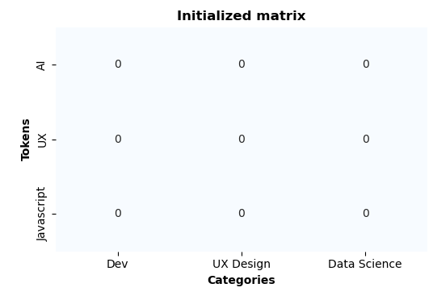 


Now, let's say there are 2 Data Processors (DP), 2 Data Aggregator (DA) and a Main Data Aggregator (MDA).

#### Data processor

When the DP does the training, it executes an `update_model` method provided by the AI provider. For instance: 

```python
def update_model(xapi_documents, nb_model):
    """
    Updates a naive Bayes model with new documents.

    Parameters:
    - xapi_documents: List of xAPI documents.
    - nb_model: A naive Bayes model initialized with specific vocabulary and categories.

    Each xAPI document is processed to extract relevant tokens and the document's category.
    The model is then updated by summing the occurrence of these tokens under their respective categories.
    """

    vocabulary = ["AI", "UX", "Javascript"]
    categories = ["Dev", "UX Design", "Data Science"]

    for document in xapi_documents:
        # Function to extract tokens related to categories from xAPI documents.
        tokens, category = extract_tokens_and_category(document)

        # Update the model's counts for each token in the document
        for token in tokens:
            if token in vocabulary and category in categories:
                nb_model[token][category] += 1

    save_model(nb_model)

```

After training, the matrix weights are updated:


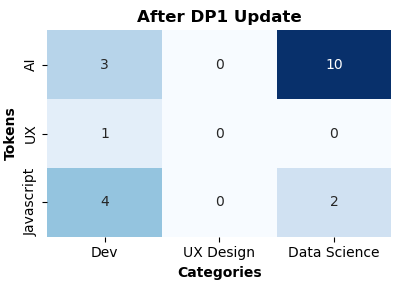 
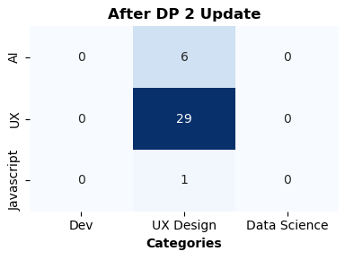

Then, each DP executes a `make_shares` method, e.g.:

```python
import numpy as np

def make_shares(model_matrix, n_splits):
    """
    Split a naive Bayes model matrix into multiple parts with added noise,
    such that the sum of these parts equals the original matrix.

    Parameters:
    - model_matrix (numpy.ndarray): The original model matrix.
    - n_splits (int): Number of splits (and thus number of noisy matrices to create).

    Returns:
    - list of numpy.ndarray: List of noisy matrices.
    """
    # Generate a noise matrix of the same shape as the model matrix
    noise_matrix = np.random.randn(*model_matrix.shape)

    shares = []
    for _ in range(n_splits - 1):
      # Create each share by extracting some random noise from the noise matrix
      noise = noise_matrix * np.random.rand()
      noise_matrix -= noise
      shares.append(model_matrix / n_splits + noise)

    # Ensure the last share sums up with the noise matrix
    shares.append(model_matrix / n_splits + noise_matrix)

    return shares

```

Each share is then sent to a DA. 


#### Data Aggregators

Each DA computes the aggregation of the received shares, i.e. the sum of matrix weights. Then it sends the result to the MDA.

The MDA then computes the final aggregation with a sum. Thanks to it, the noise injected by each DP is removed, and the final model is revealed.


#### Complete training example

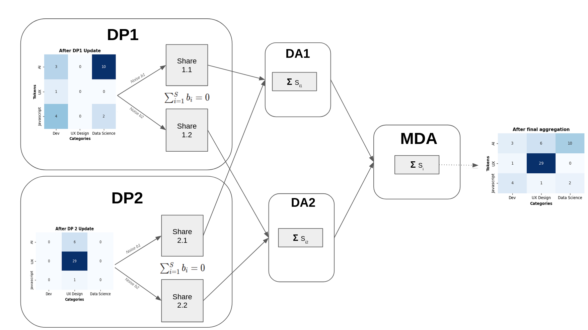


ℹ️ Please note this is a dummy example: in practice, there are never 2 nodes only to contribute. In this case, the DA would simply refuse to compute the aggregation as there would have not enough contributors to enforce diversity and anonymization. 


## Architecture

The main roles in the architecture are the following:

- Data Processor (DP): a node with authorized access to user data. This is where model updates are computed.
- Data Provider: an organization with user data. The Data Provider typically provides data to the Data Processor, but might actually be the same actor. Note that in the following, the Data Provider is sometimes merged into the Data Processor, by simplicity. 
- Data Aggregator (DA): a server node run by a trusted party that is able to receive partial model updates and perform aggregations on it.
- Orchestrator: it is run by the DissecML Service Provider (DissecML is the training protocol name) and act as a proxy to dispatch protocol requests to simplify interactions and does not store any data. It is also useful for logging and debugging. 
Note this role could eventually disappear in the future, but we expect it to be precious in this project to keep track of exchanges, handle errors, etc.
- Main Data Aggregator (MDA): a specialized DA that computes the final model aggregation including all the DP contributions.
- AI provider: an organization that publishes an AI training plan
- Catalog: it stores and publishes the AI training plans  
- DI: Data intermediary, necessary to store user consents
- Users: they express their explicit consent to contribute to an AI training plan 


### Build Execution plan

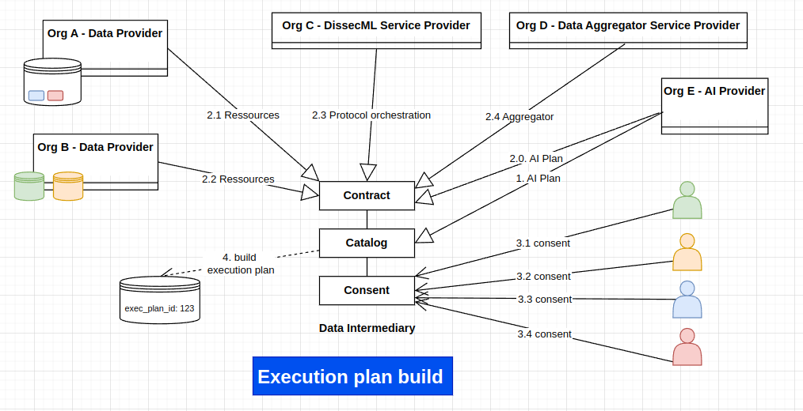

This schema depicts the creation of an execution plan. Please note that the steps are not necessarily sequential: for example, a Data Provider could join a plan through an existing contract. 
Likewise, the execution plan is incrementally and asynchronously increased with user consents.


### AI Training

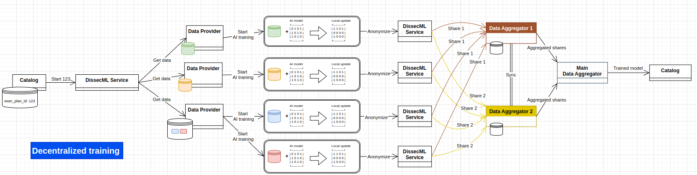

This shows a complete AI training, starting from the catalog's execution plan, to the saving of the trained model, back to the catalog.


### Aggregation tree

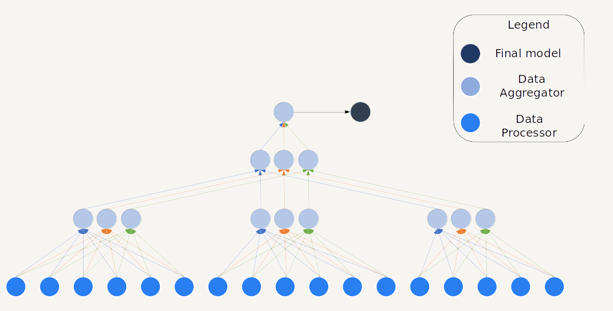

This is the shape of an aggregation tree, including Data Processors and Data Aggregators.

## Dynamic Behaviour


### AI training plan publication

An AI Provider requests the Catalog to publish an AI training plan. It includes:

- Initialized AI model
- The data format to use for training
- Algorithms to contribute  
- A user-friendly description

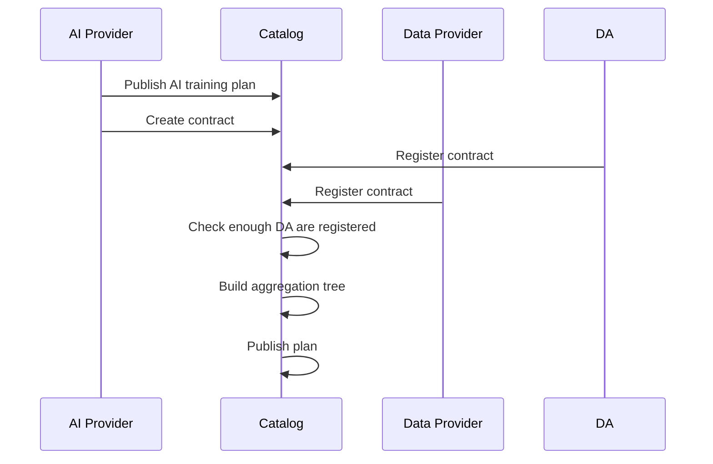


On the other side, Data Aggregators (DA) and Data Providers register to be part of an execution plan, through a contract. This execution plan includes an Aggregation Tree, describing how the training data should be split, and who should be MDA, i.e. the last aggregator producing the final model.
Once there are enough registered DA, the Catalog computes the Aggregation Tree. 

ℹ️ It is up to each Data Provider to determine whether or not it is relevant to register itself for this particular training plan, and sign the contract or not.

ℹ️ The contract between the AI Provider, Data Provider and DA is an asynchronous process. Also, please note that the DissecML service provider does not appear here by simplicity: as there should be only one Provider at the beginning, their participation in the contract is implied.

ℹ️ At this stage, the Aggregation Tree is not complete yet, as the leafs, i.e. the Data Proccesors (DP), are not known yet.

ℹ️ The Data Provider is not part of the aggregation tree itself. Its role is actaully to provide DP, that will be part of the tree.

Then, the Catalog publishes the plan. A user should be able to consent to this plan to become a DP

#### Number of DA

The minimal number of registered DA to guarantee security is 3, one of them being the MDA. 
Increasing the number of DA offer better security, as it reduces the collusion impact (i.e. 2 corrupted DA that work together to reveal model updates) as well as server loads (less work for each DA).
On the other hand, it also increases complexity, network load and risk of failures. 
So this is a trade-off to chose between those contraints.


### Consent

Once execution plans are published by the Catalog, a user must be able to give consent to be able to contribute.
The consents should be collected through the PDC of each Data Provider.


Once enough consents have been reached (which is a parameter of the execution plan), the Catalog can start the plan by requesting all the DP through their registered URL.

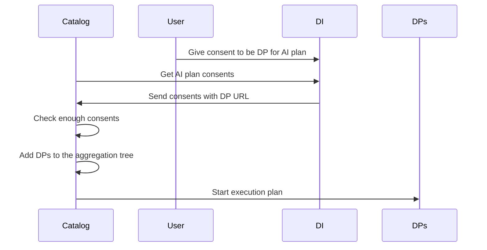

### Protocol execution


The execution starts by the Catalog sending the execution plan to all the DPs and DAs.

ℹ️ The DPs are added to the Aggregation Tree as leafs. They are transmitted to the DAs, that need to know which DP contribute. This implies that a DP participation is not considered as private. 

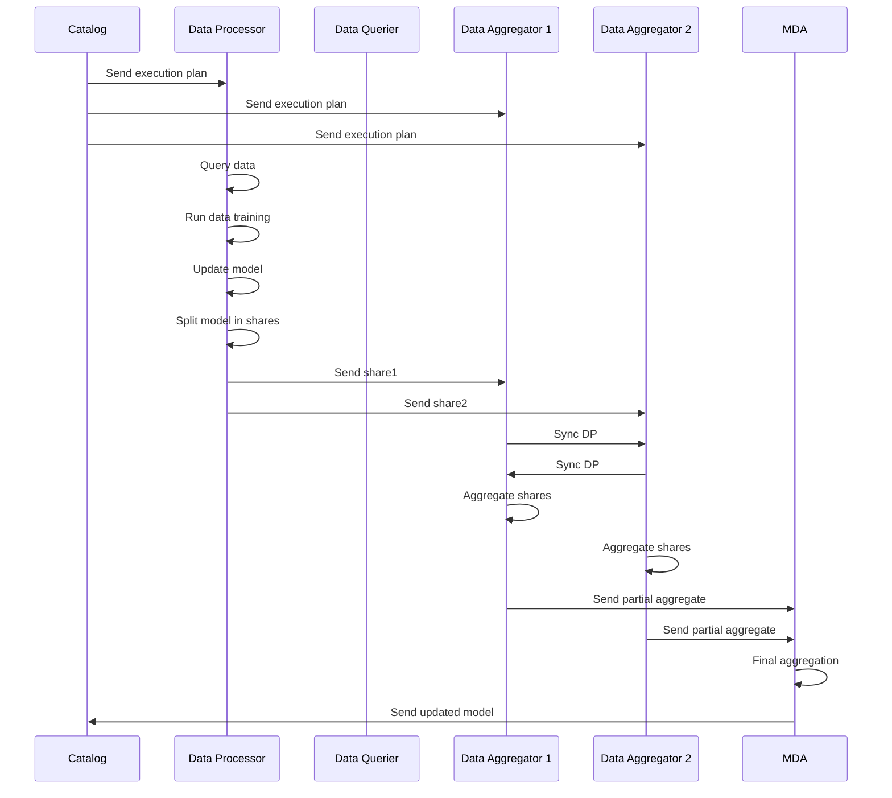


### Query data


Once it receives the execution plan, the first thing to do for a DP is to query user data.

This might be handled directly by the PDC, or by the DP, depending on implementations choices, to be determined. 


### Local Data Processing

#### Update model

The DP has now:

- The user data
- The initialized AI model
- The algorithms to contribute to the model

ℹ️ The algorithms are included directly into the AI model through a serialization mechanism e.g. with a pickle format.

Then, the DP can locally train the model based on user data, and update the model weights.  

⚠️ Depending on the AI model and data volume, this task can be quite computational heavy.  

#### Split model in shares

Once the local training is done, the data is split using a secret sharing technique. A security parameter $S$ determines the number of shares, a parameter retrieved in the execution plan metadata. 
Let $x$ be the training result, then the user creates the shares  $`\mathbf{x}_i = \mathbf{x} + b_i`$, where $b_i$ is a noise vector such that $$\sum_{i=1}^S b_i = 0$$

⚠️ It means that each share is the complete model with noise on the weights. This introduces a computational and storage overhead that might be problematic for large models.

#### Send shares to DAs

Each share is sent to the assigned DAs, as attributed in the execution plan. Once it is done, the DP removes all the local data (user data, model update, etc) that is not necessary anymore.

ℹ️ It is important to have a unique id for each execution plan, associated with each step of the protocol, to be able to run several plans in parallel.


### Aggregation

Each DA is contacted with new shares. When it receives one, it stores it locally while waiting to have all the expected shares.

ℹ️ The number of expected share is known thanks to the Aggregation Tree

Then, it launches the aggregation step: all shares are aggregated (summed) together to produce a new intermediary model. The sum of contributions is also saved. The final result is sent to the parent, to do the same thing. If the parent is the MDA, producing the last share produces the final de-noised model.

### Synchronization between leafs DAs

The DAs must imperatively aggregate the same number of shares, coming from the same contributors. Otherwise, the final aggregation will not correctly remove the noises and will result in a wrong result.

Because of their decentralized and versatile nature, we cannot expect all DP to make their contribution in time: network and computation failures can occur anytime.     
It is then necessary to have synchronization between the DAs of the first tree level (those receiving shares from DP). To this end, each DA sends the list of the received DPs.

Different synchronization strategies can be used:

- Temporal: after a fixed delay started after receiving the first share, a sync is done.
- Threshold: the sync is started as soon as a DA reaches a minimum threshold of contributions.
- Hybrid: a fixed delay is started after after the treshold is reach

Once all the DP from the DA are reunited, the intersection is computed.
If the minimal contributing threshold is reached on the intersection, the aggregation can be computed.
If the intersection does not reach the threshold, another sync can be made later, to give more time to the DP to finish their work.

⚠️ The threshold can never be reached and thus the protocol never converges. A garbage collector is then necessary, to discard an execution plan and all related data when it’s been waiting for too long on the Aggregation level. 

ℹ️ As the tree of DAs is known, each non-leaf DA knows how many shares it must receive, which makes the sync useless for the upper part of tree.

ℹ️ When the Aggregation Tree is large enough to divide the DA into groups (cf the Aggregation Tree schema), the sync is only made inside a group.  

Compute and send intermediate aggregate to parent

Once the intersection list of contributing DP is computed, each DA can now discard any DP not included in the list.
Then, it computes the intermediate aggregate from the shares of each DP, and send it to the parent DA.

    
### Final aggregation

The last DA parent is the Main Data Aggregator (MDA). Once all the expected intermediate aggregates are received, it triggers the final aggregation. Depending on the model, it may simply sum as for the DAs (typically sufficient for a naive bayes model), or compute an average, thanks to the sum of weights + the sum of contributions.

The final model is then sent and saved to the Catalog and can be retrieved by the AI provider.


## Configuration and deployment settings


The main configuration of this BB in specified by the execution plan. An example is defined [here](#execution-plan).

Each component of this BB will have to handle specific configuration, logging and error handling, notably the Orchestrator and the Data Aggregators.
The expected formats will be JSON for API settings and YAML for deployment settings.

The decentralized nature of this BB make it challenging for debugging failing scenarios, as there will be no centralized logging, but the Orchestrator component is typically made to facilitate this in the first iterations of this BB, thanks to it central role.

It is also envisioned to introduce a configuration option to allow each component of this BB to send its logs to the Orchestrator, as a debug option.

### Error scenarios

#### Missing shares

In this decentralized BB, many errors could occur, many of them being linked to network communications and particularly between Data Processors (DP) and Data Aggregators (DA).

One should understand that by design, the protocol requires that each DA on the same tree level receives exactly the same number of share, from the same children (to simplify, will we have only 2 levels at first, 2 leafs DA and one root DA, also called MDA).

As any node could fail at any time, this is quite a complicated think to handle. In fact, there is an academic publication mainly focused on this issue: https://dl.acm.org/doi/10.1145/3603719.3603730

We will rely on this work to implement a mechanism where DA on the same tree level are able to periodically sync with each others, and reach a consensus on a shares list, to perform the aggregation and pass the results to the upper tree level.

When it is impossible to converge, typically because of missing shares, all the execution plan should be discarded. To do it, some garbage collector will periodically check the DA status and decide whether or not the execution plan can converge. If not, a cleanup will be made and the Orchestrator will be informed on this failure.

There will be a status API endpoint that can be queried on the Orchestrator to know about an execution plan status at any time.

The Orchestrator will also have a garbage collector mechanism, in case not enough shares are produced from the DP for an execution plan.

#### Integrity failures

If there are any computational errors on the training or aggregation part, the final model might be meaningless, even if the whole protocol successfully converged.

This is not something that can be entirely prevented, but several actions can envisioned to minimize the risks.

First, it is necessary to evaluate the produced model. This will be done by the [BB feature](#featuresmain-functionalities): "Model accuracy could be evaluated".

Then, each computational step should have an independant integrity check. This includes:
- Raw data retrieval
- AI training
- DP share generation
- DA share aggregation

A failing integrity check should handle an error that will be treated specifically depending on where it happens.


## Third Party Components & Licenses

This BB will partially rely on the [Cozy stack](https://github.com/cozy/cozy-stack).

The code will be released in AGPLv3.


## Implementation Details

TBC

## OpenAPI Specification

TBC

## Test specification

### Decentralized Testing using Distributed Test Data
 Testing a machine learning model in a decentralized environment without using a centralized dataset (the most widely used method in the literature) is feasible. The aim is to evaluate the model's performance on distributed data sources (DP) without gathering all the test data in a central server. 

 The idea is to have the DP for the test plan as we have for the train plan.  Test data remains decentralized, and the model is evaluated on several DP. Then, test results are securely aggregated without exposing the raw data. This can be implemented using principles similar to the decentralized protocol used to train the model, with secure aggregation techniques and privacy-preserving mechanisms. 

 Decentralized testing steps :

 - Distribute trained model to DP: Once the model has been trained, the final global model is distributed to all DP holding test data. Each DP can then perform the evaluation locally on its data.

 - Local evaluation at each DP: Each node performs a local test of the model using its decentralized test dataset. This involves:  i) Loading the global model; ii) Running predictions on locally available test data; iii) Calculating local performance metrics such as accuracy, precision, recall, F1 score or any other relevant metric (can be specified when creating the Test plan). 

 - Sharing securely the local results: After calculating the perfromance measures, each DP shares them with the DA. Secure aggregation techniques, such as the secret sharing method used during the model training phase, can also be applied here (compute the metrics, split the metric values, send the shares to diffrent DA).

 - Aggregation of test metrics: Each DA securely sums up the shares of individual nodes to calculate global performance metrics without requiring direct access to the test data of individual DP. 

 - Global Performance Calculation: Once the shares are aggregated, the MDA reconstructs the global performance metrics (e.g., overall accuracy, confusion matrix) from the aggregated results. This provides a complete view of the model's performance across all decentralized test datasets. 


### Test plan
 

#### Protocol execution test

We describe the steps for a complete test of the protocol execution to train an AI model.

**Setup**
  * 2 running DA servers
  * At least 2 running DP

Execution plan:
```json
{
  "id": "execution_plan_test",
  "training_plan": {
    "id": "training_test",
    "model_name": "Activity success test",
    "model_id": "model_test",
    "target_data": {
      "type": "xAPI",
    },
    "model_description": "Model test",
    "base_model": "https://dissecml.test.cozycloud.cc/base_model_test",
  },
  "aggregation_tree": {
    "aggregators": [
      {
        "url": "https://dissecml-da1.test.cozycloud.cc",
        "org": "Cozy Cloud"
      },
      {
        "url": "https://dissecml-da2.test.cozycloud.cc",
        "org": "Cozy Cloud"
      },
    ],
    "processors": [
      {
        "url": "https://dissecml-dp1.cozy.works"
      },
      {
        "url": "https://dissecml-dp2.cozy.works"
      }
    ]
  }
}
```

**Steps**

* Request endpoint start with execution plan, e.g. `https://dissecml.test.cozycloud.cc/run/`
  * Expected response: 200 OK
* Wait for enough time for the protocol to complete: by design, this test cannot be realtime.
The protocol triggers several computations on different nodes, with many network exchanges. Depending on the data volume, the number of nodes,the bandwith and the processing power, the protocol can take from minutes to hours to converge. For testing purpose, the expected convergence time should be in a magnitude of minutes.
* Request endpoint result on the execution plan id e.g. `https://dissecml.test.cozycloud.cc/run/execution_plan_test`

**Expected result**

```json
{
  "execution_plan_id": "execution_plan_test",
  "training_plan_id": "training_test",
  "model_name": "Activity success test",
  "model_id": "model_test",
  "model_version": "1.1",
  "contributors_count": 2,
  "timestamp": 1234567,
  "model": "https://dissecml.test.cozycloud.cc/model_test_1-1"
}
```

The timestamp is when the new model is produced, so it *must* be greater than the timestamp at the start of the test.

ℹ️ The produced model is not directly provided as it can be quite big. Rather it is saved on a URL. 
Note the model itself roughly consists of a set of parameters shaping a specific model type (neural network, regression, classification, etc).
The model should be exported in an interoperable format, such as pickle or joblib.

ℹ️ Note this test does not validate the model correctness. For this, internal tests are expected in each component. As mentioned in the [errors scenarios](#error-scenarios) section, there are different cases that could result in integrity failures, which should be handled by the BB components and validated through unit tests.


### Internal unit tests

TBC

### Component-level testing

The component-level testing is already handled by the test plan. 


### UI test (where relevant)

Does not apply

## Reputation Score 

The use of a reputation mechanism in a decentralized environment such as federated learning is crucial. It can improve the robustness of the system against malicious or low-quality DP, such as those submitting noisy, erroneous or contradictory updates.

The proposed reputation mechanism is based on the decentralized aggregation protocol. Following we propose how we can compute a reputation score : 

- What is the reputation score for DP : A reputation score for each   DP can be defined according to the contribution of its model updates ( local model of DP) to the overall training process. For example, reputation can be linked to accuracy, in other words, the evolution of model performance after the integration of a node's updates (increase or decrease). Or also it can be linked to the similarity between the local and global models parameters (Advantage : no need for test data, challenge :  high dimensionalty of model parameters). 

The main challenge of federated learning is to calculate the reputation score without revealing the raw data or updates from individual models. The following paragraph describes the mechanism linked to accuracy and the use of test data. At t=0, all the DP are assigned a neutral reputation score. 

  - Step 1 : Training the local model, submitting the updates and then the aggregation of updates : This step corresponds to the training of the AI model ( see [training example]). Once the global model is computed, it is sent back to the DP who participated in the training phase.  
  - Step 2 : Compute local reputation scores : Each DP can calculate its reputation on the basis of a local assessment using its own test data. In the proposed method, each DP has a small portion of its own data, which it uses for local testing after each training cycle. In other words, each DP divides its data into training data and test data, the former used to train the model, the latter for evaluation purposes (test evaluation or compute the reputation score).   One way to compute the reputation score is to approximate the contribution of the DP when integrating its updates. On a given DP, the idea consists in testing the global model and the global model without the updates (substract the local model parameters from the global model parameters) of the DP on the local test data.  
    - If the global model (with DP updates) performs better than the global model without DP updates, this indicates that the DP contribution has been beneficial, and the DP receives a higher reputation score.
    - If the global model (without DP update) performs better, this means that the DP update has not contributed to the model's performance, or has even harmed it, resulting in a lower reputation score.

  - Step 3 : the contribution to the gloabl model are sent to the DA and the MDA, to quantify correctly the reputation score across all the DP. 

This approach provides a theoretical basis for calculating the reputation score, but further research is needed to assess its effectiveness and fairness, particularly in the context of the decentralized federated protocol used.

## Partners & roles

### Cozy Cloud

- Protocol and architecture conception 
- Protocol and architecture implementation
- Testing infrastructure


### Loria

- Define an exhaustive list of AI models that can be used through conducting a state-of-the-art review
- Model evaluation
- Reputation score strategy based on game theory

### UoK

- Expertise on mapping to Data Space Reference Architecture Models 
- Evaluation of federated learning protocol in Data Space context:
  - Privacy & security aspects
  - Communication overhead induced by decentralization
  

### UiO

- Expertise on federated learning protocols

## Usage in the dataspace

This BB will be a core component of the Decentralized AI Training Service Chain.

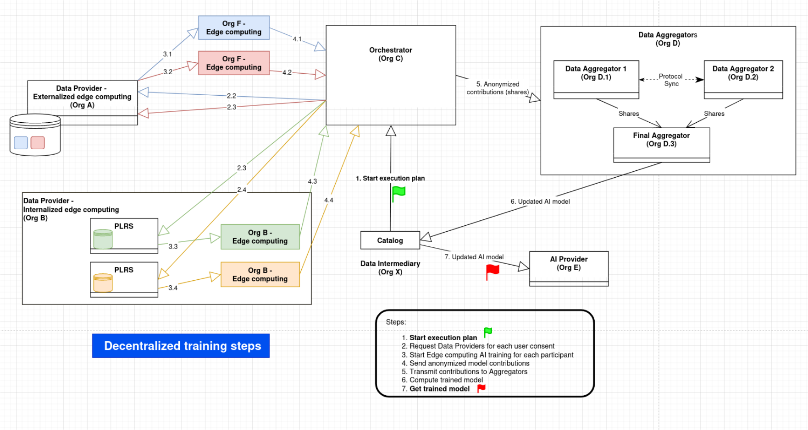