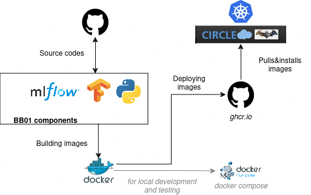

# Decentralized AI training BB – Design Document

The goal of this building block is to allow a decentralized training of AI models, i.e. without the need to centralize training data. This is particularly virtuous in the case of training on personal data, which is complicated to centralize for reasons of privacy, security, and regulation. 

Our approach relies on the concept of [federated learning](https://research.google/blog/federated-learning-collaborative-machine-learning-without-centralized-training-data/), by introducing a decentralized governance in such a way that no central actor should have the possibility to access or infer training data.

## Technical usage scenarios & Features

*Decentralized AI training building block (BB01)* is responsible to train a gradient-based AI model (e.g. neural network) in a decentralized manner.

### Features/main functionalities

- BB01 offers an API in the Catalog, through which dedicated *training initiators* can start a distributed AI training process. Building on the functionality of BB02, providing a cloud-based cluster architecture with geofencing and secure communication, this BB trains an AI model in a federated learning manner. *Model users* can download this method.
- Contributing data provider nodes might be selected or excluded depending on their reputation score if necessary.
- Model accuracy shall be evaluated.

### Technical usage scenarios

Various Data Providers shall agree on a common AI model architecture that shall be trained with their data in a decentralized manner. In case they need reputation scoring and reputation scoring-based aggregation, they shall volunteer data to construct a representative test data set.

Data Processors, Aggregators, and other computing resources (i.e., an orchestrator entity) are connected by BB02's cloud service (Kubernetes cluster). BB02 handles secure and PTX-communication. BB02 can also handle different "privacy zones", i.e., geographic restrictions. 
Data Providers shall define Data Processor entities who are obligated to process their raw data.
Hence, Data Providers, BB02, and BB01 shall sign contracts and appropriate consents in the catalog. (As Aggregators are part of BB01, and they do not process raw personal records (only technical data); we do not need to register them into the catalog.)
BB01's workflow requires that the training architecture cluster of BB02 shall already be set up, including that Data Processors have already downloaded train data from Data Providers.

BB01 provides algorithms for decentralized AI training through an API. Once a training initializer calls BB01's interface, Data Processors do "local model updates", train the model on the data supplied by  corresponding Data Providers. 

After that, Aggregators collect local model updates and construct the federated model. Aggregators might have a hierarchal structure. If needed, aggregators also compute reputation scores. The training initiators can prescribe various aggregating algorithms (i.e., FedAvg and DeltaRep - a reputation score-based aggregation function). The aggregator data can be downloaded and evaluated.

Thanks to this, one can train AI models on a huge variety of user data, that is normally very hard 
to access, for reasons of privacy, security, and regulation.

#### Demos

[Demo1](demos.md#demo1---minimal-working-example) - a minimal working example with 2 data processors and a single aggregator.

## Requirements

BB01 provides algorithms for decentralized AI training. Its core functionality is composed of data processors, aggregators, and the orchestrator.

For detailed requirements, see [requirements.md](requirements.md)

## Integrations
### Direct integration with other BBs
- PTX Catalogue: BB01 is a registered service in the PTX catalogue. BB01 provides an interface through which the *installer* can obtain the credentails to download BB01's components. BB01 provides an interface through which training initiators can start the decentralized AI training. BB01 provides an interface through which the model users can download and evaluate the model.
- Contract: To use BB01, contracts between an infrastructure provider (i.e., BB02), and data providers shall be signed.
- Consent: Enabling execution of the decentralized AI training with data processors' data on the servers of the infrastructure provider.
- BB02: thight integration with the specific protocol
- Trustworthy AI: the created AI model shall be trustworthy.

### Integration via Connector
Access of this BB for the installers, training intiators and model users are expected to be done via the Connector.

### Integration with Infrastructure Providers
The decentralized AI training BB is closely integrated with BB02.

## Relevant standards

### Data format standards

- Every external communication is through `json` format.

- This BB uses `FastAPI` implementation; therefore, implementing `OpenAPI` specifications.

- This BB allows model users to download `Pytorch` and `Tensorflow` saved models.

### Mapping to Data Space Reference Architecture Models

_Mapping to [DSSC](https://dssc.eu/space/DDP/117211137/DSSC+Delivery+Plan+-+Summary+of+assets+publication) or [IDS RAM](https://docs.internationaldataspaces.org/ids-knowledgebase/v/ids-ram-4/)_


#### DSSC

This building blocks has a mapping with the following DSSC building blocks:

- [Value-Added Service](https://dssc.eu/space/BVE/357076468/Value-Added+Services)
  - The building block finality is to allow the training of AI models and bring value over user data. 
- [Access & Usage Policies Enforcement](https://dssc.eu/space/BVE/357075567/Access+%26+Usage+Policies+Enforcement)
  - This building block ensures that users consents to give access to their data, only on the purpose of model training.
  - The accessed data can be a subset of the overall data: only the data necessary for the training.
  - The Data Processor must provide strong security guarantees to the Data Provider.
- [Provenance & Traceability ](https://dssc.eu/space/BVE/357075283/Provenance+%26+Traceability)
  - It is important in this building block to have a support for traceability and enable clear logging for the different steps.
  - Each role is transparent and clearly specified, ensuring provenance tracking.  

#### IDS-RAM

- [Big Data and Artificial Intelligence](https://docs.internationaldataspaces.org/ids-knowledgebase/v/ids-ram-4/context-of-the-international-data-spaces/2_1_data-driven-business_ecosystems/2_7_big_data_and_artificial_intelligence)
  - This building block enables AI training and application leveraging AI models.
- There are similar concepts with this building blocks in the IDS-RAM Process layer, notably:
  - [Data Offering](https://docs.internationaldataspaces.org/ids-knowledgebase/v/ids-ram-4/layers-of-the-reference-architecture-model/3-layers-of-the-reference-architecture-model/3_4_process_layer/3_4_2_data_offering)
  - [Contract Negotiation](https://docs.internationaldataspaces.org/ids-knowledgebase/v/ids-ram-4/layers-of-the-reference-architecture-model/3-layers-of-the-reference-architecture-model/3_4_process_layer/3_4_3_contract_negotiation)
  - [Exchanging Data](https://docs.internationaldataspaces.org/ids-knowledgebase/v/ids-ram-4/layers-of-the-reference-architecture-model/3-layers-of-the-reference-architecture-model/3_4_process_layer/3_4_4_exchanging_data)

## Architecture

BB01 consists of 3 internal component types: data processors, aggregators, and an orchestrator.

BB01 also has a separated API, registered into the PTX-catalogue.

For detailed architecture description, please check the [Decentralized AI training building block architecture](architecture.md) document.

## Dynamic behaviour

## Configuration and deployment settings

BB01 follows a microservices software architecture; therefore, its components are containerized into `Docker` containers. It allows decoupling algorithms from execution environment.



BB01 supports two deployment types. The first type uses `docker-compose` and serves development and testing; meanwhile, the other one supports a production deployment on a `Kubernetes`-based cluster.

### Docker-compose deployment
For test deployment (requires installed docker and docker-compose on local computer), please run the following commands from the root directory of this repository:
```bash
cd 04_deploy
./deploy.sh --test-deploy
```

The above command builds necesarry docker images, and starts the docker-compose architecture.

---
---

### Kubernetes cluster deployment
For production deployment on BB02 (Edge computing building block), please follow the following instruction.

1. build and publish docker images to a docker repository (i.e. `ghcr.io`, requires necessary access tokens and docker installed on local machine):
```bash
cd 04_deploy
./deploy.sh --cluster-deploy
```

2. start BB02 with the images that have just been created. To do so, follow [instructions in BB02 documentation](https://github.com/Prometheus-X-association/edge-computing/tree/main/kubernetes/deployment/training).


### Error scenarios
#### Missing shares

In this decentralized BB, many errors could occur, many of them being linked to network communications and particularly between Data Processors (DP) and Data Aggregators (DA).

One should understand that by design, the protocol requires that each DA on the same tree level receives exactly the same number of share, from the same children (to simplify, will we have only 2 levels at first, 2 leafs DA and one root DA, also called MDA).

As any node could fail at any time, this is quite a complicated think to handle. In fact, there is an academic publication mainly focused on this issue: [https://dl.acm.org/doi/10.1145/3603719.3603730](https://dl.acm.org/doi/10.1145/3603719.3603730)

We will rely on this work to implement a mechanism where DA on the same tree level are able to periodically sync with each others, and reach a consensus on a shares list, to perform the aggregation and pass the results to the upper tree level.

When it is impossible to converge, typically because of missing shares, all the execution plan should be discarded. To do it, some garbage collector will periodically check the DA status and decide whether or not the execution plan can converge. If not, a cleanup will be made and the Orchestrator will be informed on this failure.

There will be a status API endpoint that can be queried on the Orchestrator to know about an execution plan status at any time.

The Orchestrator will also have a garbage collector mechanism, in case not enough shares are produced from the DP for an execution plan.

#### Integrity failures

If there are any computational errors on the training or aggregation part, the final model might be meaningless, even if the whole protocol successfully converged.

This is not something that can be entirely prevented, but several actions can envisioned to minimize the risks.

First, it is necessary to evaluate the produced model. This will be done by the [BB feature](#featuresmain-functionalities): "Model accuracy could be evaluated".

Then, each computational step should have an independant integrity check. This includes:
- Raw data retrieval
- AI training
- DP share generation
- DA share aggregation

A failing integrity check should handle an error that will be treated specifically depending on where it happens.


## Third party components & licenses

The code will be released in AGPLv3.


## OpenAPI specification
TBA

## Test specification

### Test plan

For detailed test specification, see [test specifiation document](tests.md)

## Partners & roles
### Cozy Cloud
- Architecture conception

### BME
- Expertise on federated learning
- Protocol and architecture implementation
- Infrastructure
- Testing

### UiO
- Expertise on federated learning protocols

## Usage in dataspace
This BB can be a component in decentralized AI training service chains.

