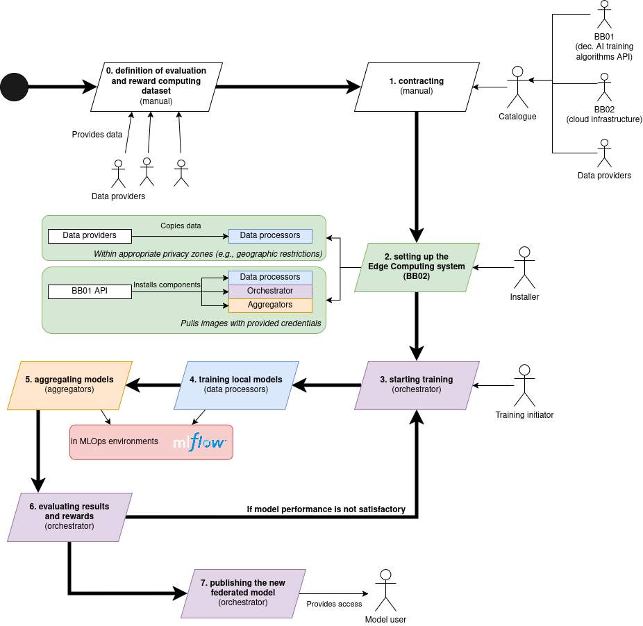
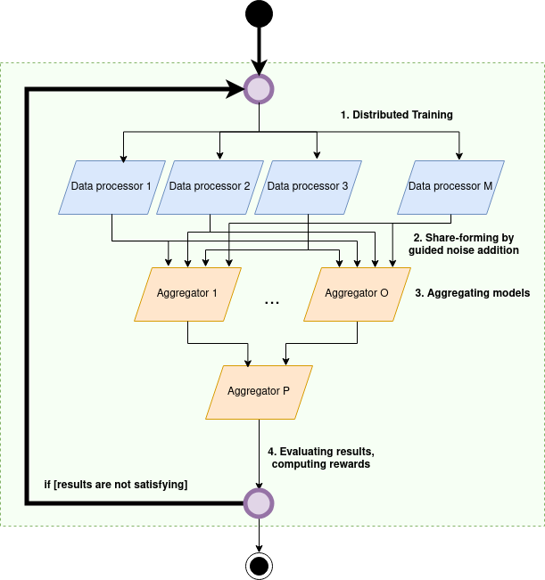
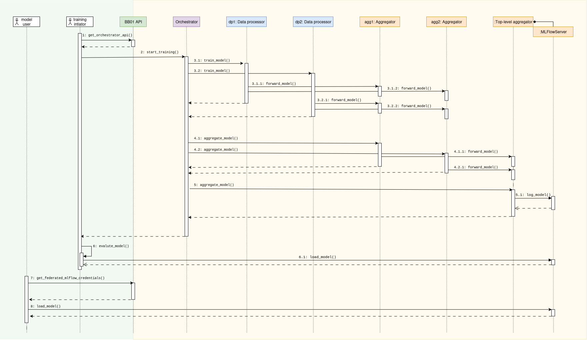
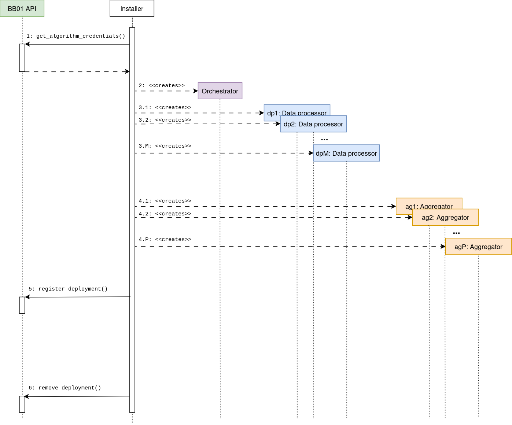

# Dynamic behavior of the BB

## Overview


**Preliminaries:**
1. data providers shall construct an appropriate [test set](#test-set-criterion).
2. BB01, data providers and BB02 (infrastructure provider) shall sign PTX-contracts.
3. The installer shall [setup the system](#system-setup).

After setting up the system, through BB01's API, training initators can start the federated learning process. Federated learning's clients are the data processors, having data providers' data. They compute local model updates by training AI models until convergence. The locally convergent models are aggregated by (possibly hierarchically) aggregators.

## Internal behavior - Aggregation



BB01 implements a multilayered federated learning. In this setup, there are a number of data processors and a hierarchal aggregator structure, similarly to [Mirval, Bouganim, and Popa - "Federated Learning on Personal Data Management Systems: Decentralized and Realiable Secure Aggregation Protocols" - 2023](https://dl.acm.org/doi/10.1145/3603719.3603730).

Data processors train local AI models; then, by adding systematic noise to the model's weight matrix, they create *model shares*. Model shares are sent to different client aggregators. Aggregators can have multiple layers, ending in a *top level* aggregator.

When the top level aggregator creates the federated model, all the added noise will be canceled out. This leads to a privacy-preserving aggregation protocol which does not hinder the performance of the training process.

## Usage of BB01


1. Once the building block is deployed, training initiators can query BB01's API through PDC for orchestrator's endpoint (including URI and corresponding credentials).

2. Through the provided endpoint, training initiators can start the training process. To do so, training initiators shall define the aggregation architecture. The orchestrator expects a `json` file, listing the training clients (`data_processors` with their `uri`), and the aggregators (`aggregators` with their `uri`). For each data processor and aggregator target aggregator URIs shall be given (`forward_model_to`). The only exception from this rule is the *top-level aggregator*, of which `forward_model_to` key shall have an empty string. For aggregators, training initiators shall specify whether or not an aggregator is `top_level_aggregator`, and its level in the aggregation tree, `aggregation_level`. The top-level-aggregator shall have the highest specified level, while those aggregators that are connected to data processors shall have an `aggregation_level` of 0. Training initiators shall specify also the aggregation algorithm (`"aggregation_algorithm": "fedavg"` or `"aggregation_algorithm": "deltarep"`) For example:
```json
{
    "processors": [
        {
            "uri": "http://data-processor-0:8000",
            "train_data_uri": "/data/train_data.npz",
            "forward_model_to": ["http://aggregator-1:8000", "http://aggregator-2:8000"]
        },
        {
            "uri": "http://data-processor-1:8000",
            "train_data_uri": "/data/train_data.npz",
            "forward_model_to": ["http://aggregator-1:8000", "http://aggregator-2:8000"]
        }
    ],
    "aggregators": [
        {
            "uri":"http://aggregator-1:8000",
            "forward_model_to": ["http://aggregator-top:8000"],
            "top_level_aggregator": false,
            "aggregation_level": 0
        },
        {
            "uri":"http://aggregator-2:8000",
            "forward_model_to": ["http://aggregator-top:8000"],
            "top_level_aggregator": false,
            "aggregation_level": 0
        },
        {
            "uri":"http://aggregator-top:8000",
            "forward_model_to": [],
            "top_level_aggregator": true,
            "aggregation_level": 1
        }
    ],
    "aggregation_algorithm": "fedavg"
}
```

3. BB01 will run 1 communication round, and evaluate the federated model's performance with the provided test data. If the model does not perform well enough, training initators can repeat the training process. We note that *client selection and aggregator architecture specification* is the responsibility of the training initiator.

4. If model users wants to download the federated model or check its performance, they shall get credentials to the federated MLFLow server (which is the top level aggregator's MLFLow server) from BB01's API, through PDC. With the provided endpoint (URI and credentials), model users can access the MLFlow server.

## Appendix
### Test set criterion
Data providers shall construct a test dataset conforming the following rules:

1. the dataset shall represent well enough the combined dataset of the data prviders (i.e., minimizing the KL-divergence between the distribution of the test set and combined set)
2. none of the data providers shall access the test set. Rationale: if any of the data providers would process the test dataset, it could create an efficient attack even against the reputation-aware (DeltaRep) aggregation.

### System setup


To setup the system, the installer shall request credentials from BB01's API to download corresponding `docker` images for BB01's internal components.

With these credentials, the installer can deploy the system either in a `docker compose` setup, or on [BB02](https://github.com/Prometheus-X-association/edge-computing/tree/main/kubernetes/deployment/training).

Lastly, the installer shall register its deployment at BB01's API.