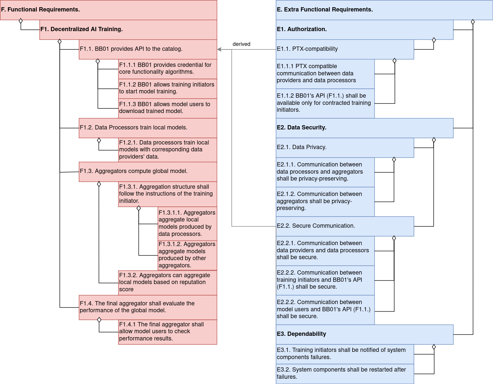

# Requirements for Decentralized AI Training Building Block (BB01)

## Functional Requirements

F1. BB01 shall provide algorithms for decentralized AI training, i.e., federated learning.

The core functionality of BB01 consists of data processors, aggregators, and a singleton orchestrator.

Detailed functional requirements:

| req. id | description |
|---------|-------------|
|F1.1. | BB01 shall provide an API to the PTX catalogue. |
|F1.1.1.| BB01's API shall provide credentials for the installer to the core functionality algorithms. |
|F1.1.2.| BB01's API shall allow training initators to start the model training. |
|F1.1.3.| BB01's API shall allow model users to download the trained model. |
|F1.2. | Data processors shall train custom local models.|
|F1.2.1.| Data processors shall train local models with corresponding data provider's data. |
|F1.3. | Aggregators shall compute the global model. |
|F1.3.1.| Aggregation structure shall follow the instructions of the training initator.|
|F1.3.1.1.| Aggregators shall aggregate local models produced by data processors.|
|F1.3.1.2.| Aggregators shall aggregate models produced by other aggregators. |
|F1.3.2. | Aggregators can aggregate local models based on reputation score.|
|F1.4. | The final aggregator shall evaluate the performance of the global model.|
|F1.4.1. | The final aggregator shall allow model users to check performance results. |

## Extra functional requirements

|req. id | description |
|--------|-------------|
|E1. | BB01 shall only provide access to authorized users.|
|E1.1.| BB01 shall be compatible with the Prometheus-X data space.|
|E1.1.1| BB01 shall use PDC communication between data providers and data processors. |
|E1.1.2| BB01's API (F1.1.) shall only be available for training initiators contracted through the Prometheus-X data space system.|
|E2. | BB01 shall provide data security.|
|E2.1.| BB01 shall provide data privacy.|
|E2.1.1.| Communication between data processors and aggregators shall be privacy-preserving. |
|E2.1.2.| Communication between aggregators shall be privacy-preserving. |
|E2.2.| BB01 shall use secure communication. |
|E2.2.1. | Communication between data providers and data processors shall be secure. |
|E2.2.2. | Communication between training initiators and BB01's API (F1.1.) shall be secure. |
|E2.2.3. | Communication between model users and BB01's API (F1.1.) shall be secure. |
|E3. | BB01 shall be accessible during the training process. |
|E3.1. | Training initiators shall be notified of system components failures. |
|E3.2. | System components shall be restarted after failures. |