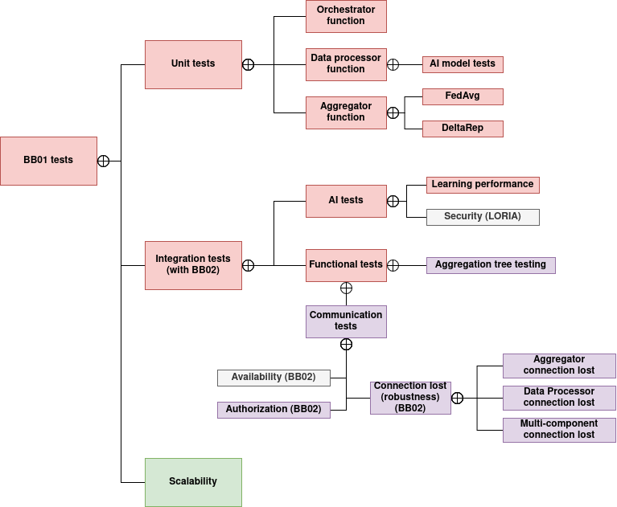

# Test specification

## Overview



## Test plan
For our unit tests, we use `Python`'s `pytest` framework. When testing our components (e.g., aggregator, data_provider, or orchestrator), we choose a path to test functionalities through components' endpoints. To this end, each `pytest`'s prerequisite is that the tested component's container shall be up and running. Pytest can handle these by itself, it the container is required for every test and it will be started up onece before the 1st test and will be stopped after all the tests are executed.

We have also automated these tests with [Github Actions workflows](https://github.com/Prometheus-X-association/decentralized-ai-training/actions). These testing workflows are triggered by `pull requests` towards the repositry's main branch and scheduled to run on each Sunday after 8:00 PM (in CET timezone). Additionally, the workflow can also be triggered manually.

## Test cases


| id     | short description             | tested components       | corresponding requirement             |
|--------|-------------------------------|-------------------------|---------------------------------------|
|TC1     | Aggregator testing - FedAvg   | aggregator              | F1.3, F1.3.1, F1.3.1.1, F1.3.1.2, F1.4|
|TC2     | Aggregator's Mlflow authentication testing| aggregator  | E1                                    |


### TC 1 - Aggregator testing - FedAvg
The goal of this test case is to test the aggregator's `FedAvg` model aggregation function through it's `do_aggregate` endpoint. For this purpose, we created some simple models which will serve as `client_models` as an input for the aggregator. These models were trained on the MNIST dataset (see `aggregator_test` python notebook in the [05_test/aggragator_test](../05_test/test_aggregator.ipynb) folder). We wanted some weak learners which will be combined by the aggregator so we have made an imbalanced data partition of the train data on purpose (see [MNIST-partitioner notebook](../03_dev/share_sim/mnist_partitioner.ipynb)).

#### Setup test environment
Corresponding GitHub Action workflow automatically handles starting the test environment.


#### Run tests
The test case consist 2 pytest [unit tests](../05_test/aggragator_test/aggregator_test.py):

1. `test_fedavg_aggregation`: The 1st test calls the do_aggregate endpoint after the client_models are retrieved from our cloud server through an ssh tunnel. This test only checks whether the aggregation by FedAvg algorithm was successful by checking the response of the endpoint. 
2. `test_pull_fedavg_model`: This test will pull the previously aggregated model from the aggregator's MLFLow server and compares its performance with the client models. 

Run the following commands:

```bash
$ pytest 05_test/aggregator_test
```

#### Expected results
We have two acceptance criteria:

1. The endpoint shall return with a `200 OK` answer.
2. If both the loss of the aggregated model is less than the weakest client model's loss and the accuracy of the aggregated model is higher then the weakest client model's accuracy than we consider the aggregation successful and the test passes.

### TC 2 - Aggregator's Mlflow authentication testing
To shall ensure proper access to the models, we introduced the roles of *aggregator* (can upload and download models) and *model_user* (can only download models). In this test case, we check whether or not the proper access rights are ensured by the Aggregator's MLFlow server.

#### Setup test environment
Corresponding GitHub Action workflow automatically handles starting the test environment.

#### Run tests
We implemented functions to that are trying to login and make operations on the MLFlow server:
- Check if an unauthorized user can list experiments.
- Check if an admin user can list experiments.
- Check if an admin user can create a new experiment.
- Check if an aggregator user can push a model.
- Check if a model_user user can push a model.
- Check if an unauthorized user can push a model.
- Check if an aggregator or a model_user user can pull a model.
- Check if an unauthorized user can pull a model.

Run the following commands:
```bash
    pytest 05_test/aggregator_test/mlflow_auth_test
```
 
#### Expected results
 This test case is successful if:
* An unauthenticated user can't do any operations with the mlflow server.
* A user authenticated as model_user can only pull existing models from the mlflow server but can't push a model.
* A user authenticated as aggregator can both push a trained model and can pull existing models from the server.