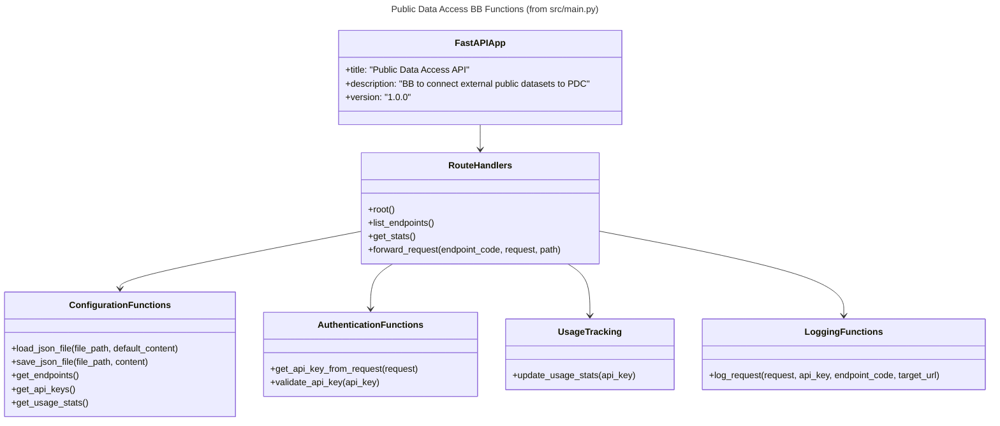

# Public Data Access BB – Design Document

The Public Data Access Building Block (BB) is a pass-through API service that forwards requests to external endpoints through a single, consistent interface. Built on FastAPI, it serves as a configurable proxy service that handles basic authentication validation, logging, and usage analytics while forwarding requests to configured external endpoints such as EUROSTAT APIs.

The BB consists of a lightweight FastAPI application (titled "Public Data Access API") with JSON-configurable endpoints, optional API key authentication, usage statistics tracking, and request logging. It enables seamless proxying of external API requests through a single gateway while maintaining basic security validation and request monitoring.


## Technical usage scenarios & Features

The Public Data Access BB serves as a unified gateway for European public data APIs, enabling applications to access multiple government and institutional data sources through a single, standardized interface with built-in security and monitoring capabilities.

### Features/main functionalities

* **Pass-through Proxy Service**: Forwards requests to configured external endpoints based on endpoint codes
* **Multi-Method Authentication**: Support for X-API-Key headers, Bearer tokens (Authorization header), and query parameter authentication
* **JSON-based Endpoint Configuration**: Configurable endpoints via `config/endpoints.json` with support for path-based and query-based parameter forwarding
* **Usage Statistics Tracking**: Basic tracking of API usage counts per API key and open access usage
* **Request Logging**: Structured JSON logging of API requests with client information and partial API key logging for security
* **HTTP Method Support**: Supports GET, POST, PUT, DELETE, PATCH, HEAD, OPTIONS methods for forwarding
* **Timeout Handling**: 30-second timeout for external API requests with appropriate error responses
* **Optional Authentication**: API key validation when provided, but endpoints can be accessed without authentication
* **Auto-generated OpenAPI Documentation**: FastAPI automatically generates documentation accessible at `/docs` endpoint

### Technical usage scenarios

* **Data Aggregation Applications**: Applications requiring access to multiple European public datasets (statistical data, etc.) through a single integration point
* **Business Intelligence Systems**: Analytics platforms requiring EUROSTAT statistical data with consistent API interfaces
* **Research & Development**: Academic and research institutions accessing multiple public datasets for analysis and reporting
* **Government Service Integration**: Public sector applications integrating multiple European data sources for citizen services
* **Third-party API Management**: Organizations wanting centralized authentication and monitoring for multiple public data API access
* **Microservices Architecture**: Systems requiring a dedicated data access layer that abstracts multiple external public APIs
* **Development & Testing**: Development teams needing consistent interfaces for public data APIs across different environments

## Requirements

### System Requirements

* **Python 3.11+** (tested with Python 3.13)
* **pip** (Python package installer)
* **Docker** (optional, for containerized deployment)
* **Docker Compose** (optional, for orchestrated deployment)

**Python Dependencies:**
* FastAPI 0.104.1 - Web framework
* Uvicorn 0.24.0 - ASGI server
* httpx 0.25.2 - Async HTTP client
* python-multipart 0.0.6 - Form data parsing
* requests 2.31.0 - HTTP library

### Functional Requirements

* **R1.** BB MUST provide unified access to multiple European public data APIs through a single interface
* **R2.** BB MUST support dynamic endpoint configuration via JSON configuration files
* **R3.** BB MUST support optional API key authentication via headers (X-API-Key, Authorization Bearer) and query parameters
* **R4.** BB MUST provide basic usage statistics tracking for API key usage and open access
* **R5.** BB MUST implement request logging with client information and secure partial API key logging
* **R6.** BB MUST forward data object paths and query parameters to external APIs
* **R7.** BB MUST provide HTTP error responses (401, 404, 408, 502, 500) with descriptive error messages
* **R8.** BB MUST allow access to endpoints without authentication when no API key is provided

### Non-Functional Requirements

* **R9.** BB MUST respond to API requests within 5 seconds under normal load conditions
* **R10.** BB MUST support minimum 100 concurrent requests per minute
* **R11.** BB MUST maintain 99.5% uptime when deployed in production environments
* **R12.** BB MUST be containerizable and deployable via Docker with persistent storage for logs and configuration
* **R13.** BB MUST provide auto-generated OpenAPI documentation accessible via web interface
* **R14.** BB MUST implement proper HTTP status codes and standardized JSON error responses
* **R15.** BB MUST support configuration changes without service restart for endpoint management


## Integrations

### Direct Integrations with Other BBs

The Public Data Access BB operates as a standalone gateway service and does not have direct integrations with other Building Blocks. It serves as a data access layer that can be consumed by other BBs requiring European public data access.

**Potential consuming BBs:**
* **Identity & Access Management BB**: Could integrate for user-based data access control and authentication delegation
* **Analytics & Reporting BB**: Could consume aggregated public data through the unified interface
* **Notification & Communication BB**: Could access skills and statistical data for targeted communications

### Integrations via Connector

The Public Data Access BB can integrate with other BBs through standard data space connectors:

* **Data Exchange BB**: Integration for secure data sharing workflows requiring public data enrichment
* **Consent Management BB**: Integration for user consent-based access to specific public datasets
* **Audit & Compliance BB**: Integration for comprehensive audit trails of public data access across the ecosystem
* **Federated Catalogue BB**: Registration of available public data endpoints and their capabilities for discovery

### External API Integrations

**Direct Public API Connections:**
* **EUROSTAT API**: European Statistical Office data services
* **Custom Public APIs**: Configurable integration with additional European public data sources


## Relevant Standards

### Data Format Standards

* **JSON**: Primary data exchange format for API requests and responses
* **OpenAPI 3.0**: API specification and documentation standard
* **SDMX (Statistical Data and Metadata eXchange)**: Standard for EUROSTAT statistical data exchange
* **HTTP/HTTPS**: Standard web protocols for secure API communication
* **REST API**: Representational State Transfer architectural style for web services
* **ISO 8601**: Date and time format standardization for timestamps and data filtering

### Mapping to Data Space Reference Architecture Models

**IDS RAM (International Data Spaces Reference Architecture Model) Mapping:**
* **Data Provider Role**: Acts as a proxy data provider for European public APIs
* **Service Provider Role**: Provides gateway and transformation services for public data access
* **Identity Provider Integration**: Supports standard authentication mechanisms compatible with IDS identity management
* **Usage Control**: Implements usage tracking and analytics aligned with IDS usage control patterns

**DSSC (Data Spaces Support Centre) Architecture Alignment:**
* **Interoperability Layer**: Provides standardized interfaces for heterogeneous public data sources
* **Trust & Security**: Implements authentication and logging mechanisms for secure data access
* **Data Sovereignty**: Maintains audit trails and access controls while respecting public data access policies
* **Technical Governance**: Supports configurable endpoint management and standardized error handling


## Input / Output Data

### Input Data

**API Requests:**
* **HTTP Method**: GET requests with query parameters or path parameters
* **Authentication Data**: API keys via headers (`X-API-Key`, `Authorization: Bearer`) or query parameters
* **Query Parameters**: Varies by target API (e.g., `text`, `language`, `type`, `startPeriod`, `endPeriod`, `format`)
* **Path Parameters**: Dataset identifiers for path-based APIs like EUROSTAT

**Configuration Data:**
* **Endpoints Configuration** (`config/endpoints.json`): Defines available public APIs and their connection parameters
* **API Keys Configuration** (`config/api_keys.json`): Manages authentication credentials
* **Usage Statistics** (`config/usage_stats.json`): Maintains access analytics and usage patterns

### Output Data

**API Responses:**
* **EUROSTAT Data**: JSON/XML statistical datasets in SDMX format containing European statistical information
* **Service Metadata**: Information about available endpoints, usage statistics, and service health
* **Error Responses**: Standardized JSON error messages with HTTP status codes and descriptive messages

**Example Usage Statistics Output:**
```json
{
  "total_requests": 1250,
  "endpoints_usage": {
    "ESTAT": 1250
  },
  "authentication_methods": {
    "api_key_header": 750,
    "bearer_token": 300,
    "query_parameter": 200
  },
  "last_updated": "2024-11-01T10:30:00Z"
}
```

**Typical Workload:**
* **Standard Request**: Single API call returning 10-100 records (1-10KB response)
* **Large Dataset Query**: EUROSTAT requests returning up to 10,000 statistical data points (100KB-1MB response)
* **Bulk Operations**: Support for concurrent requests handling 100+ API calls per minute

## Architecture

The Public Data Access BB follows a layered architecture with clear separation of concerns between API gateway functionality, configuration management, and external service integration.



**Function Purposes (from actual src/main.py):**

* **FastAPIApp**: Main FastAPI application instance with title "Public Data Access API"
* **ConfigurationFunctions**: Load/save JSON files for endpoints, API keys, and usage statistics
* **AuthenticationFunctions**: Extract API keys from requests and validate them against configuration
* **UsageTracking**: Update usage statistics for API key usage and open access counts
* **LoggingFunctions**: Log request details with structured JSON format including partial API key for security
* **RouteHandlers**: Handle HTTP routes (/, /endpoints, /usage-stats, /{endpoint_code}) and forward requests to external APIs


## Dynamic Behaviour

The Public Data Access BB operates as a stateless HTTP pass-through service that processes incoming requests, optionally validates API keys, forwards requests to configured external endpoints, and returns the responses while tracking basic usage statistics.


## Configuration and deployment settings

### Configuration Options

**Endpoints Configuration (`config/endpoints.json`)**
```json
{
  "ESTAT": {
    "code": "ESTAT", 
    "url": "https://ec.europa.eu/eurostat/api/dissemination/sdmx/2.1/data",
    "description": "EUROSTAT Statistical Data API",
    "example_usage": "ESTAT/NAMA_10_GDP/A.CP_MEUR.B1GQ.LU?startPeriod=2023&endPeriod=2024&format=json",
    "requires_auth": false,
    "auth_token": null
  }
}
```

**Configuration Fields:**
* `code`: Unique identifier for the endpoint
* `url`: Base URL of the external API
* `description`: Human-readable description of the API
* `example_usage`: Example request path demonstrating usage
* `requires_auth`: Boolean indicating if external API requires authentication
* `auth_token`: Bearer token for external API authentication (only used if `requires_auth` is true)

**API Keys Configuration (`config/api_keys.json`)**
```json
{
  "8f4e2a7b9c1d5e3a6f8b2c4d7e9f1a2b3c5d6e8f0a1b2c3d4e5f6a7b8c9d0e1f": {
    "institution": "rejustify",
    "contact_name": "rejustify",
    "contact_email": "info@rejustify.com",
    "department": "Data analysis team",
    "created_date": "2024-11-01",
    "status": "active",
    "rate_limit": 10000,
    "allowed_endpoints": ["ESTAT"],
    "timeout": 60
  }
}
```

**API Key Configuration Fields:**
* `institution`: Organization name
* `contact_name`: Primary contact person
* `contact_email`: Contact email address
* `department`: Department or team name
* `created_date`: Key creation date
* `status`: Key status (active/inactive)
* `rate_limit`: Maximum requests allowed
* `allowed_endpoints`: List of endpoint codes this key can access
* `timeout`: Request timeout in seconds (default: 30 for open access, configurable for API key users)


### Deployment Settings

**Docker Configuration**
* **Port**: 8000 (configurable via environment variables)
* **Volumes**: `/app/config`, `/app/logs` for persistent configuration and logging
* **Environment Variables**: `PORT`, `LOG_LEVEL`, `CONFIG_PATH`

**Docker Compose Setup**
```yaml
version: '3.8'
services:
  public-data-access:
    build: .
    ports:
      - "8000:8000"
    volumes:
      - ./config:/app/config
      - ./logs:/app/logs
    environment:
      - PORT=8000
      - LOG_LEVEL=INFO
```

### Logging Configuration

**Log Structure**: Structured JSON logging to `logs/api_requests.log` and console output

**Log Levels**:
* **INFO**: Successful API requests, configuration loads
* **WARNING**: Authentication failures, invalid endpoints  
* **ERROR**: External API failures, configuration errors
* **DEBUG**: Detailed request/response data (development only)

**Example Log Entry**:
```json
{
  "timestamp": "2024-11-01T10:30:00Z",
  "level": "INFO", 
  "endpoint": "ESTAT",
  "client_ip": "192.168.1.100",
  "auth_method": "api_key_header",
  "response_status": 200,
  "response_time_ms": 245,
  "external_api_status": 200
}
```

### Usage Limits & Error Scenarios

**Rate Limits**:
* **Default**: 100 requests per minute per API key
* **Burst**: Up to 10 concurrent requests per client
* **Response Timeout**: 30 seconds for external API calls

**Error Scenarios**:
* **401 Unauthorized**: Invalid/missing API key
* **404 Not Found**: Endpoint not configured
* **429 Too Many Requests**: Rate limit exceeded
* **502 Bad Gateway**: External API unavailable
* **504 Gateway Timeout**: External API response timeout

**Data Size Limits**:
* **Request**: Maximum 1MB request payload
* **Response**: Configurable response size limit (default 10MB)
* **Configuration**: Maximum 100 configured endpoints


## Third Party Components & Licenses

### Core Dependencies

* **FastAPI** (MIT License) - Modern, fast web framework for building APIs with automatic OpenAPI documentation
* **httpx** (BSD-3-Clause License) - Async HTTP client for making requests to external public APIs  
* **Uvicorn** (BSD-3-Clause License) - ASGI server implementation for serving FastAPI applications
* **Python 3.8+** (PSF License) - Runtime environment and standard libraries

### External Public APIs

* **EUROSTAT API** (European Commission) - European Statistical Office data services  
  * License: Open data under European Commission reuse policy
  * Endpoint: `https://ec.europa.eu/eurostat/api/`

### Development & Testing Dependencies

* **pytest** (MIT License) - Testing framework for unit and integration tests
* **Docker** (Apache 2.0 License) - Containerization platform for deployment
* **Docker Compose** (Apache 2.0 License) - Multi-container Docker application orchestration

### License Compliance

All dependencies use permissive open-source licenses (MIT, BSD, Apache 2.0) compatible with commercial and non-commercial use. The BB itself can be licensed under similar permissive terms. External public APIs are provided under European Commission open data policies allowing unrestricted access for research, commercial, and non-commercial purposes.


## Implementation Details

### Core Implementation Architecture

The BB is implemented as a single Python FastAPI application (`src/main.py`) with approximately 260 lines of code, focusing on simplicity and maintainability. The implementation follows a functional programming approach with clear separation between configuration management, request processing, and external API communication.

**Key Implementation Patterns:**
* **Configuration-driven**: All external API endpoints defined in JSON configuration files
* **Stateless operation**: No persistent state between requests, enabling horizontal scaling
* **Async HTTP handling**: Uses httpx for non-blocking external API calls
* **Defensive programming**: Comprehensive error handling and input validation

### File Structure & Responsibilities

```
src/
├── main.py              # FastAPI application with all route handlers
├── __init__.py          # Package initialization

config/
├── endpoints.json       # External API endpoint configurations  
├── api_keys.json       # Authentication credential management
└── usage_stats.json    # Real-time usage analytics storage

logs/
└── api_requests.log    # Structured request/response logging
```

### Security Implementation

* **Multi-layer Authentication**: Three authentication methods with fallback hierarchy
* **Input Sanitization**: Query parameter validation and sanitization before forwarding
* **Audit Logging**: Comprehensive logging of authentication events and API access
* **Configuration Security**: API keys stored in separate configuration files with controlled access

### Deployment Considerations

* **Container Ready**: Dockerfile optimized for production deployment with multi-stage builds
* **Health Checks**: Built-in health check endpoints for container orchestration
* **Volume Management**: Persistent volumes for configuration and logs in containerized environments
* **Environment Configuration**: Support for environment variable overrides in deployment scenarios


## OpenAPI Specification

The Public Data Access BB automatically generates OpenAPI 3.0 specification documentation accessible at the `/docs` endpoint when the service is running. The interactive documentation provides:

**Available Endpoints:**
* `GET /` - Service information with endpoint listing and version details
* `GET /endpoints` - List all configured endpoint codes with their configurations
* `GET /usage-stats` - Usage statistics showing open access and API key usage counts
* `ANY /{endpoint_code}` - Forward request to configured endpoint (supports all HTTP methods)
* `ANY /{endpoint_code}/{path:path}` - Forward request with path parameters to configured endpoint

**Authentication Documentation:**
* **X-API-Key Header**: `X-API-Key: {api_key}`
* **Bearer Token**: `Authorization: Bearer {token}`  
* **Query Parameter**: `?api_key={api_key}`
* **Optional**: Authentication is validated when provided but not required for access

**Response Schema Examples:**
* Standard success responses with HTTP 200 and JSON data
* Error responses with appropriate HTTP status codes (401, 404, 429, 502)
* Usage statistics schema with request counts and analytics

**Access Interactive Documentation:**
```bash
# Start the BB service
docker compose up
# or 
./scripts/start.sh

# Access OpenAPI documentation
open http://localhost:8000/docs
```

The OpenAPI specification is automatically kept in sync with the implementation and includes all dynamically configured endpoints from `config/endpoints.json`.

## Test specification

### Test plan

**Testing Strategy**: Multi-layered testing approach covering unit tests, integration tests, and end-to-end component testing using Python pytest framework and manual verification procedures.

**Tools Used**:
* **pytest**: Python testing framework for unit and integration tests
* **curl**: Command-line HTTP client for API endpoint testing
* **Docker**: Containerized testing environment for component-level testing

**Acceptance Criteria**:
* All authentication methods must work correctly (X-API-Key, Bearer, query parameter)
* External API integration must return proper responses for EUROSTAT
* Usage analytics must update correctly after each request
* Error handling must return appropriate HTTP status codes
* Configuration changes must be reflected without service restart

### Internal unit tests

**Test Implementation**: `tests/test_api.py` using pytest framework

**Test Cases Covered**:
* **Authentication Validation**: Test all three authentication methods with valid and invalid credentials
* **Configuration Loading**: Verify JSON configuration file parsing and error handling
* **Request Forwarding**: Test parameter formatting for both query-based and path-based APIs
* **Usage Analytics**: Validate usage statistics tracking and persistence
* **Error Response**: Test standardized error responses for various failure scenarios
* **Logging Functionality**: Verify structured logging output and security measures

**Test Execution**:
```bash
# Setup test environment
python3 -m venv venv
source venv/bin/activate
pip3 install -r requirements.txt

# Run unit tests
python tests/test_api.py
```

### Component-level testing

**Integration Test Approach**: Full BB testing as integrated component using real external API endpoints

**Test Environment Setup**:
1. Start BB service: `./scripts/start.sh`
2. Verify external API accessibility (EUROSTAT)  
3. Ensure BB configuration files are properly loaded

**Test Cases**:
```bash
# Test EUROSTAT API integration
curl "http://localhost:8000/ESTAT/NAMA_10_GDP/A.CP_MEUR.B1GQ.LU?startPeriod=2023&endPeriod=2024&format=json"

# Test multi-method authentication
curl -H "X-API-Key: 8f4e2a7b..." "http://localhost:8000/ESTAT/..."
curl -H "Authorization: Bearer 8f4e2a7b..." "http://localhost:8000/ESTAT/..."
curl "http://localhost:8000/ESCO?text=programmer&api_key=8f4e2a7b..."

# Test BB metadata endpoints  
curl "http://localhost:8000/endpoints"
curl "http://localhost:8000/usage-stats"
curl "http://localhost:8000/"

# Test error scenarios
curl "http://localhost:8000/NONEXISTENT"  # 404 test
curl "http://localhost:8000/ESCO"  # 401 authentication test
```

**Expected Results**: 
* HTTP 200 responses for valid requests with proper JSON data
* HTTP 401/404/502 responses for error scenarios with standardized error format
* Usage statistics updated after each successful request
* Proper logging entries in `logs/api_requests.log`

### UI test (where relevant)

**OpenAPI Documentation Testing**: Manual verification of auto-generated API documentation

**Test Cases**:
* Verify `/docs` endpoint accessibility and proper rendering
* Test interactive API documentation functionality 
* Validate authentication examples in documentation
* Confirm endpoint discovery matches configuration

## Partners & roles

### Development Partners

**Prometheus-X Association**
* **Role**: Lead development organization and technical owner
* **Contributions**: 
  * Overall BB architecture design and implementation
  * FastAPI application development and security implementation
  * Configuration management system design
  * Authentication and authorization mechanisms
  * Usage analytics and monitoring capabilities
  * Docker containerization and deployment strategies
  * Documentation and testing framework development

### Data Provider Partners

**European Commission - EUROSTAT**  
* **Role**: Public data provider for European statistical information
* **Contributions**:
  * Statistical data API providing economic, social, and demographic data
  * SDMX-compliant data formats for standardized statistical exchange
  * Comprehensive European Union statistical datasets
  * Historical and current statistical time series data

### Operational Partners

**Data Space Ecosystem Participants**
* **Role**: Integration partners and BB consumers
* **Expected Contributions**:
  * Integration requirements definition for data space connector compatibility
  * Use case validation and functional requirement specification  
  * Production deployment testing and scalability validation
  * Feedback on API usability and documentation quality

## Usage in the dataspace

### Dataspace Enabling Service Chain Integration

The Public Data Access BB operates as a **Data Access Layer** component within the broader dataspace ecosystem, providing standardized access to European public data sources for various dataspace participants and use cases.

**Primary Service Chain Position:**
```
Data Space Participants → Identity & Access Management BB → Public Data Access BB → European Public APIs (ESCO/EUROSTAT)
                                    ↓
                           Audit & Compliance BB ← Usage Analytics & Monitoring
```

### Integration with Dataspace Components

**Upstream Integration (Data Consumers):**
* **Business Intelligence & Analytics Platforms**: Integration with EUROSTAT data for economic analysis, market research, and policy development
* **Government Service Portals**: Public sector applications requiring multiple European datasets for citizen services

**Horizontal Integration (Peer BBs):**
* **Identity & Access Management BB**: Delegation of authentication and authorization for user-based access control
* **Consent Management BB**: Integration for privacy-compliant access to public data based on user consent preferences  
* **Federated Catalogue BB**: Registration and discovery of available public data endpoints and their capabilities
* **Contract & Policy Management BB**: Enforcement of data usage policies and access agreements

**Downstream Integration (Infrastructure):**
* **Data Space Connectors**: Standard connector interfaces for secure data exchange protocols
* **Audit & Compliance BB**: Comprehensive audit trails for regulatory compliance and data governance
* **Monitoring & Alerting Services**: Health monitoring and performance analytics for dataspace operations

### Value Proposition in Dataspace Context

* **Simplified Integration**: Single API gateway reducing complexity of accessing multiple European public data sources
* **Standardized Access Patterns**: Consistent authentication, error handling, and response formats across diverse public APIs
* **Enhanced Security & Governance**: Centralized access control, audit logging, and usage analytics for compliance requirements
* **Ecosystem Interoperability**: Standard interfaces enabling seamless integration with other dataspace building blocks
* **Scalable Public Data Access**: Support for high-volume access to European public datasets with proper rate limiting and monitoring
